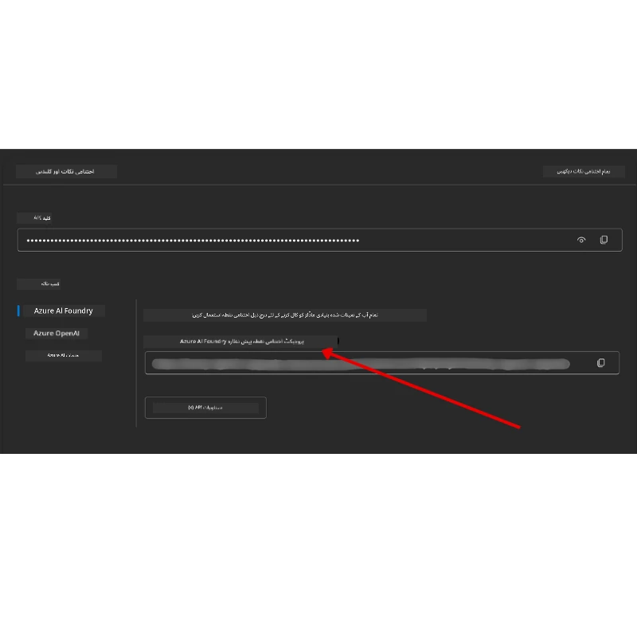

# کورس کی ترتیب

## تعارف

یہ سبق کورس کے کوڈ نمونوں کو چلانے کے طریقے کو کور کرے گا۔

## دوسرے سیکھنے والوں میں شامل ہوں اور مدد حاصل کریں

اپنا ریپو کلون کرنے سے پہلے، کسی بھی ترتیب میں مدد، کورس کے بارے میں سوالات، یا دوسرے سیکھنے والوں سے رابطہ قائم کرنے کے لیے [AI Agents For Beginners Discord چینل](https://aka.ms/ai-agents/discord) میں شامل ہوں۔

## اس ریپو کو کلون یا فورک کریں

شروع کرنے کے لیے، براہ کرم GitHub ریپوزیٹری کو کلون یا فورک کریں۔ اس سے آپ کے پاس کورس میٹریل کا اپنا ورژن ہو جائے گا تاکہ آپ کوڈ چلا سکیں، ٹیسٹ کر سکیں، اور اس میں تبدیلی کر سکیں!

یہ آپ ریپو کو <a href="https://github.com/microsoft/ai-agents-for-beginners/fork" target="_blank">فورک کرنے</a> کے لنک پر کلک کرکے کر سکتے ہیں۔

اب آپ کے پاس اس کورس کا اپنا فورک شدہ ورژن درج ذیل لنک میں ہونا چاہیے:


### شالو کلون (ورکشاپ / کوڈ اسپیسز کے لیے تجویز کردہ)

> پورا ریپوزیٹری مکمل ہسٹری اور تمام فائلوں کے ساتھ ڈاؤن لوڈ کرنے پر بڑا ہوسکتا ہے (~3 GB)۔ اگر آپ صرف ورکشاپ میں شرکت کر رہے ہیں یا صرف چند سبق فولڈرز کی ضرورت ہے، تو شالو کلون (یا اسپارس کلون) زیادہ تر ڈاؤن لوڈ سے بچا لیتا ہے کیونکہ یہ ہسٹری کو محدود کرتا ہے اور/یا بلیبز کو چھوڑ دیتا ہے۔

#### تیز شالو کلون — کم از کم ہسٹری، تمام فائلیں

نیچے دیے گئے کمانڈز میں `<your-username>` کو اپنے فورک URL (یا اگر پسند کریں تو اپ اسٹریم URL) سے بدلیں۔

صرف تازہ ترین کمیٹ ہسٹری کلون کرنے کے لیے (چھوٹا ڈاؤن لوڈ):

```bash|powershell
git clone --depth 1 https://github.com/<your-username>/ai-agents-for-beginners.git
```
  
کسی مخصوص برانچ کو کلون کرنے کے لیے:

```bash|powershell
git clone --depth 1 --branch <branch-name> https://github.com/<your-username>/ai-agents-for-beginners.git
```
  
#### جزوی (اسپارس) کلون — کم از کم بلیبز + صرف منتخب شدہ فولڈرز

یہ جزوی کلون اور اسپارس چیک آؤٹ استعمال کرتا ہے (Git 2.25+ اور جدید Git جو جزوی کلون کی حمایت کرتا ہو کی ضرورت ہے):

```bash|powershell
git clone --depth 1 --filter=blob:none --sparse https://github.com/<your-username>/ai-agents-for-beginners.git
```
  
ریپو فولڈر میں جائیں:

```bash|powershell
cd ai-agents-for-beginners
```
  
پھر وہ فولڈرز منتخب کریں جو آپ چاہتے ہیں (نیچے دیا گیا مثال دو فولڈرز دکھاتا ہے):

```bash|powershell
git sparse-checkout set 00-course-setup 01-intro-to-ai-agents
```
  
کلون کرنے اور فائلز کی تصدیق کے بعد، اگر آپ کو صرف فائلز کی ضرورت ہے اور جگہ خالی کرنی ہے (کوئی git ہسٹری نہیں)، تو براہ کرم ریپوزیٹری metadata کو حذف کر دیں (💀 ناقابل واپسی — آپ تمام Git فنکشنز کھو دیں گے: کوئی کمیٹس، پل، پش، یا ہسٹری تک رسائی نہیں)۔

```bash
# زی ایس ایچ/باش
rm -rf .git
```
  
```powershell
# پاور شیل
Remove-Item -Recurse -Force .git
```
  
#### GitHub Codespaces استعمال کرنا (مقامی بڑے ڈاؤن لوڈ سے بچنے کے لیے تجویز کردہ)

- اس ریپو کے لیے نیا Codespace GitHub UI سے بنائیں [GitHub UI](https://github.com/codespaces)۔

- بنے ہوئے Codespace کے ٹرمینل میں اوپر دیئے گئے شالو/اسپارس کلون کمانڈز میں سے ایک چلائیں تاکہ صرف آپ کو ضروری سبق فولڈرز Codespace ورک اسپیس میں آئیں۔
- اختیاری: Codespaces کے اندر کلون کرنے کے بعد، اضافی جگہ خالی کرنے کے لیے .git کو حذف کریں (اوپر ہٹانے کے کمانڈز دیکھیں)۔
- نوٹ: اگر آپ ریپو کو براہ راست Codespaces میں (بغیر اضافی کلون کے) کھولنا پسند کرتے ہیں، تو ذہن میں رکھیں کہ Codespaces ڈیولپمنٹ کنٹینر ماحول تشکیل دے گا اور ہوسکتا ہے آپ کو ضرورت سے زیادہ وسائل دیا جائے۔ فریش Codespace میں شالو کاپی کلون کرنا آپ کو ڈسک استعمال پر زیادہ کنٹرول دیتا ہے۔

#### مشورے

- ہمیشہ کلون URL کو اپنے فورک کے ساتھ بدلیں اگر آپ ترمیم یا کمیٹ کرنا چاہتے ہیں۔
- اگر بعد میں مزید ہسٹری یا فائلز چاہیے ہوں، تو آپ انہیں fetch کر سکتے ہیں یا sparse-checkout ایڈجسٹ کر سکتے ہیں تاکہ اضافی فولڈرز شامل ہوں۔

## کوڈ چلانا

یہ کورس Jupyter Notebooks کی ایک سیریز پیش کرتا ہے جنہیں آپ چلا کر AI Agents کی تخلیق کا عملی تجربہ حاصل کر سکتے ہیں۔

کوڈ نمونے **Microsoft Agent Framework (MAF)** استعمال کرتے ہیں جس میں `AzureAIProjectAgentProvider` ہے، جو **Azure AI Agent Service V2** (Responses API) کو **Microsoft Foundry** کے ذریعے جوڑتا ہے۔

تمام Python نوٹ بکس کا لیبل `*-python-agent-framework.ipynb` ہے۔

## ضروریات

- Python 3.12+
  - **نوٹ**: اگر آپ کے پاس Python 3.12 انسٹال نہیں ہے، تو اسے انسٹال کریں۔ پھر python3.12 کا استعمال کرتے ہوئے اپنا venv بنائیں تاکہ requirements.txt فائل سے صحیح ورژنز انسٹال ہوں۔
  
    >مثال

    Python venv ڈائریکٹری بنائیں:

    ```bash|powershell
    python -m venv venv
    ```
  
    پھر venv ماحول کو فعال کریں:

    ```bash
    # زی ایس ایچ/باش
    source venv/bin/activate
    ```
  
    ```dos
    # Command Prompt for Windows
    venv\Scripts\activate
    ```
  
- .NET 10+: .NET استعمال کرنے والے نمونوں کے لیے، یقینی بنائیں کہ آپ نے [.NET 10 SDK](https://dotnet.microsoft.com/download/dotnet/10.0) یا اس کے بعد والا ورژن انسٹال کیا ہے۔ پھر اپنے .NET SDK ورژن کی جانچ کریں:

    ```bash|powershell
    dotnet --list-sdks
    ```
  
- **Azure CLI** — توثیق کے لیے ضروری۔ [aka.ms/installazurecli](https://aka.ms/installazurecli) سے انسٹال کریں۔
- **Azure Subscription** — Microsoft Foundry اور Azure AI Agent Service تک رسائی کے لیے۔
- **Microsoft Foundry Project** — ایک منصوبہ جس میں ڈپلائے شدہ ماڈل ہو (مثلاً `gpt-4o`)۔ نیچے [Step 1](#مرحلہ-1-microsoft-foundry-پروجیکٹ-بنائیں) دیکھیں۔

ہم نے اس ریپوزیٹری کے روٹ میں `requirements.txt` فائل شامل کی ہے جس میں کوڈ نمونے چلانے کے لیے درکار تمام Python پیکجز شامل ہیں۔

آپ انہیں درج ذیل کمانڈ چلا کر انسٹال کر سکتے ہیں:

```bash|powershell
pip install -r requirements.txt
```
  
ہم متنبہ کرتے ہیں کہ Python کے ورچوئل ماحول بنائیں تاکہ کسی قسم کے ٹکراؤ اور مسائل سے بچ سکیں۔

## VSCode کی ترتیب

یقینی بنائیں کہ آپ VSCode میں درست Python ورژن استعمال کر رہے ہیں۔


## Microsoft Foundry اور Azure AI Agent Service کی ترتیب

### مرحلہ 1: Microsoft Foundry پروجیکٹ بنائیں

آپ کو Jupyter نوٹ بکس چلانے کے لیے Azure AI Foundry کا **ہب** اور **پروجیکٹ** چاہیے جس میں ڈپلائے شدہ ماڈل ہو۔

1. [ai.azure.com](https://ai.azure.com) پر جائیں اور اپنے Azure اکاؤنٹ سے سائن ان کریں۔
2. ایک **ہب** بنائیں (یا موجودہ کا استعمال کریں)۔ دیکھیں: [Hub resources overview](https://learn.microsoft.com/azure/ai-foundry/concepts/ai-resources)۔
3. ہب کے اندر ایک **پروجیکٹ** بنائیں۔
4. **Models + Endpoints** → **Deploy model** سے ماڈل (مثلاً `gpt-4o`) کو ڈپلائے کریں۔

### مرحلہ 2: اپنے پروجیکٹ کا اینڈپوائنٹ اور ماڈل ڈپلائمنٹ کا نام حاصل کریں

Microsoft Foundry پورٹل میں اپنے پروجیکٹ سے:

- **Project Endpoint** — **Overview** صفحے پر جائیں اور اینڈپوائنٹ URL کاپی کریں۔



- **Model Deployment Name** — **Models + Endpoints** پر جائیں، اپنا ڈپلائے شدہ ماڈل منتخب کریں، اور **Deployment name** نوٹ کریں (جیسے `gpt-4o`)۔

### مرحلہ 3: `az login` کے ذریعے Azure میں سائن ان کریں

تمام نوٹ بکس توثیق کے لیے **`AzureCliCredential`** استعمال کرتے ہیں — API keys کی ضرورت نہیں۔ اس کے لیے Azure CLI کے ذریعے سائن ان ہونا ضروری ہے۔

1. اگر آپ نے Azure CLI انسٹال نہیں کیا تو انسٹال کریں: [aka.ms/installazurecli](https://aka.ms/installazurecli)

2. لاگ ان کرنے کے لیے یہ کمانڈ چلائیں:

    ```bash|powershell
    az login
    ```
  
    اگر آپ ریموٹ یا Codespace ماحول میں بغیر براؤزر کے ہیں:

    ```bash|powershell
    az login --use-device-code
    ```
  
3. اگر پوچھا جائے تو اپنی سبسکرپشن منتخب کریں — جس میں آپ کا Foundry پروجیکٹ ہے۔

4. تصدیق کریں کہ آپ سائن ان ہیں:

    ```bash|powershell
    az account show
    ```
  
> **کیوں `az login`؟** نوٹ بکس `azure-identity` پیکج کا `AzureCliCredential` استعمال کرتے ہیں۔ اس کا مطلب ہے کہ آپ کا Azure CLI سیشن آپ کو توثیق فراہم کرتا ہے — آپ کی `.env` فائل میں کوئی API keys یا سیکریٹس نہیں۔ یہ ایک [سیکیورٹی کا بہترین طریقہ](https://learn.microsoft.com/azure/developer/ai/keyless-connections) ہے۔

### مرحلہ 4: اپنی `.env` فائل بنائیں

مثال فائل کو کاپی کریں:

```bash
# زی ایس ایچ/بی اے ش
cp .env.example .env
```
  
```powershell
# پاور شیل
Copy-Item .env.example .env
```
  
`.env` کھولیں اور یہ دو ویلیوز درج کریں:

```env
AZURE_AI_PROJECT_ENDPOINT=https://<your-project>.services.ai.azure.com/api/projects/<your-project-id>
AZURE_AI_MODEL_DEPLOYMENT_NAME=gpt-4o
```
  
| متغیر | کہاں ملے گا |
|----------|-----------------|
| `AZURE_AI_PROJECT_ENDPOINT` | Foundry پورٹل → آپ کا پروجیکٹ → **Overview** صفحہ |
| `AZURE_AI_MODEL_DEPLOYMENT_NAME` | Foundry پورٹل → **Models + Endpoints** → آپ کے ڈپلائے کردہ ماڈل کا نام |

زیادہ تر اسباق کے لیے بس اتنا ہی کافی ہے! نوٹ بکس آپ کے `az login` سیشن کے ذریعے خودکار طریقے سے توثیق کریں گے۔

### مرحلہ 5: Python Dependencies انسٹال کریں

```bash|powershell
pip install -r requirements.txt
```
  
ہم تجویز کرتے ہیں کہ اسے آپ نے جو ورچوئل ماحول بنایا ہے وہاں چلائیں۔

## سبق 5 (Agentic RAG) کے لیے اضافی ترتیب

سبق 5 **Azure AI Search** استعمال کرتا ہے ریٹریو-آگمینٹڈ جنریشن کے لیے۔ اگر آپ یہ سبق چلانے کا ارادہ رکھتے ہیں، تو اپنی `.env` فائل میں یہ ویریبلز شامل کریں:

| متغیر | کہاں ملے گا |
|----------|-----------------|
| `AZURE_SEARCH_SERVICE_ENDPOINT` | Azure پورٹل → آپ کا **Azure AI Search** ریسورس → **Overview** → URL |
| `AZURE_SEARCH_API_KEY` | Azure پورٹل → آپ کا **Azure AI Search** ریسورس → **Settings** → **Keys** → پرائمری ایڈمن کی |

## سبق 6 اور سبق 8 (GitHub Models) کے لیے اضافی ترتیب

سبق 6 اور 8 میں کچھ نوٹ بکس Azure AI Foundry کی جگہ **GitHub Models** استعمال کرتے ہیں۔ اگر آپ ان نمونوں کو چلانا چاہتے ہیں، تو اپنی `.env` فائل میں یہ ویریبلز شامل کریں:

| متغیر | کہاں ملے گا |
|----------|-----------------|
| `GITHUB_TOKEN` | GitHub → **Settings** → **Developer settings** → **Personal access tokens** |
| `GITHUB_ENDPOINT` | `https://models.inference.ai.azure.com` استعمال کریں (ڈیفالٹ ویلیو) |
| `GITHUB_MODEL_ID` | استعمال کرنے والا ماڈل نام (مثلاً `gpt-4o-mini`) |

## متبادل پرووائیڈر: MiniMax (OpenAI-Compatible)

[MiniMax](https://platform.minimaxi.com/) بڑے کانٹیکسٹ ماڈلز (204K ٹوکن تک) OpenAI-موافق API کے ذریعے فراہم کرتا ہے۔ چونکہ Microsoft Agent Framework کا `OpenAIChatClient` کسی بھی OpenAI-موافق اینڈپوائنٹ کے ساتھ کام کرتا ہے، آپ MiniMax کو GitHub Models یا OpenAI کے متبادل کے طور پر استعمال کر سکتے ہیں۔

اپنی `.env` فائل میں یہ ویریبلز شامل کریں:

| متغیر | کہاں ملے گا |
|----------|-----------------|
| `MINIMAX_API_KEY` | [MiniMax Platform](https://platform.minimaxi.com/) → API Keys |
| `MINIMAX_BASE_URL` | `https://api.minimax.io/v1` استعمال کریں (ڈیفالٹ ویلیو) |
| `MINIMAX_MODEL_ID` | استعمال کرنے والا ماڈل نام (مثلاً `MiniMax-M2.7`) |

**دستیاب ماڈلز**: `MiniMax-M2.7` (تجویز کردہ), `MiniMax-M2.7-highspeed` (تیز تر جوابات)

`OpenAIChatClient` استعمال کرنے والے کوڈ نمونے (مثلاً سبق 14 ہوٹل بکنگ ورک فلو) خود بخود آپ کی MiniMax ترتیب کو تلاش کر لیں گے جب `MINIMAX_API_KEY` سیٹ ہو۔

## سبق 8 (Bing Grounding Workflow) کے لیے اضافی ترتیب

سبق 8 میں شرطی ورک فلو نوٹ بک **Bing grounding** Azure AI Foundry کے ذریعے استعمال کرتی ہے۔ اگر آپ یہ نمونہ چلانا چاہتے ہیں، تو اپنی `.env` فائل میں یہ ویریبل شامل کریں:

| متغیر | کہاں ملے گا |
|----------|-----------------|
| `BING_CONNECTION_ID` | Azure AI Foundry پورٹل → آپ کے پروجیکٹ → **Management** → **Connected resources** → آپ کی Bing کنکشن → کنکشن ID کاپی کریں |

## مسائل کا حل

### macOS پر SSL سرٹیفیکیٹ کی تصدیق کے مسائل

اگر آپ macOS پر ہیں اور ذیل کا ایرر آتا ہے:

```plaintext
ssl.SSLCertVerificationError: [SSL: CERTIFICATE_VERIFY_FAILED] certificate verify failed: self-signed certificate in certificate chain
```
  
یہ macOS پر Python کے ساتھ ایک معروف مسئلہ ہے جہاں سسٹم کے SSL سرٹیفیکیٹس خودکار طور پر قابل اعتماد نہیں ہوتے۔ درج ذیل حل ترتیب وار آزمائیں:

**اختیار 1: Python کی Install Certificates اسکرپٹ چلائیں (تجویز کردہ)**

```bash
# اپنے نصب شدہ پائتھن ورژن کے ساتھ 3.XX کو بدلیں (مثلاً، 3.12 یا 3.13):
/Applications/Python\ 3.XX/Install\ Certificates.command
```
  
**اختیار 2: نوٹ بک میں `connection_verify=False` استعمال کریں (صرف GitHub Models نوٹ بکس کے لیے)**

سبق 6 کے نوٹ بک (`06-building-trustworthy-agents/code_samples/06-system-message-framework.ipynb`) میں ایک کمنٹیڈ ورکاﺅنڈ پہلے سے شامل ہے۔ جب کلائنٹ بنا رہے ہوں تو `connection_verify=False` ان کومنٹ کریں:

```python
client = ChatCompletionsClient(
    endpoint=endpoint,
    credential=AzureKeyCredential(token),
    connection_verify=False,  # اگر آپ سرٹیفکٹ کی غلطیوں کا سامنا کرتے ہیں تو SSL تصدیق کو غیر فعال کریں
)
```
  
> **⚠️ خبردار:** SSL کی تصدیق بند کرنا (`connection_verify=False`) سیکیورٹی کم کرتا ہے کیونکہ سرٹیفیکیٹ کی تصدیق کو چھوڑ دیتا ہے۔ اسے صرف ترقیاتی ماحول میں عارضی حل کے طور پر استعمال کریں، پیداوار میں کبھی نہیں۔

**اختیار 3: `truststore` انسٹال اور استعمال کریں**

```bash
pip install truststore
```
  
پھر نیٹ ورک کال کرنے سے پہلے اپنی نوٹ بک یا اسکرپٹ کے اوپر یہ شامل کریں:

```python
import truststore
truststore.inject_into_ssl()
```
  
## کہیں پھنس گئے ہیں؟

اگر آپ کو اس ترتیب کے دوران کوئی مسئلہ ہو، تو ہمارے <a href="https://discord.gg/kzRShWzttr" target="_blank">Azure AI Community Discord</a> میں شامل ہوں یا <a href="https://github.com/microsoft/ai-agents-for-beginners/issues?WT.mc_id=academic-105485-koreyst" target="_blank">مسئلہ رپورٹ کریں</a>۔

## اگلا سبق

آپ اب اس کورس کا کوڈ چلانے کے لیے تیار ہیں۔ مصروف علمی سے AI Agents کی دنیا کے بارے میں مزید جانیں!

[AI Agents اور ایجنٹ استعمال کے مقدمات کا تعارف](../01-intro-to-ai-agents/README.md)

---

<!-- CO-OP TRANSLATOR DISCLAIMER START -->
**دفعِ ذمہ داری**:  
یہ دستاویز AI ترجمہ سروس [Co-op Translator](https://github.com/Azure/co-op-translator) کے ذریعے ترجمہ کی گئی ہے۔ جبکہ ہم درستگی کے لئے کوشاں ہیں، براہ کرم آگاہ رہیں کہ خودکار ترجمے میں غلطیاں یا عدم درستیاں ہو سکتی ہیں۔ اصل دستاویز اپنی مادری زبان میں ہی معتبر ماخذ سمجھی جائے۔ اہم معلومات کے لیے پیشہ ور انسانی ترجمہ تجویز کیا جاتا ہے۔ اس ترجمے کے استعمال سے پیدا ہونے والی کسی بھی غلط فہمی یا غلط تشریح کی ذمہ داری ہم پر عائد نہیں ہوتی۔
<!-- CO-OP TRANSLATOR DISCLAIMER END -->