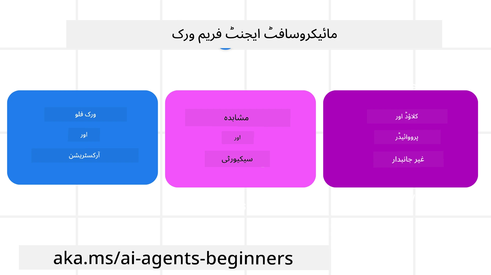
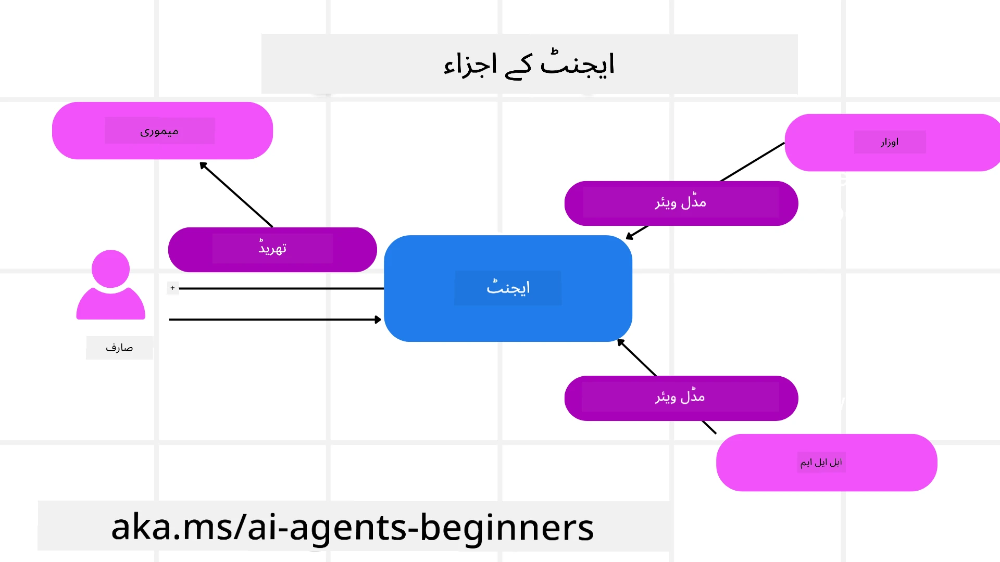

# مائیکروسافٹ ایجنٹ فریم ورک کی کھوج


### تعارف

یہ سبق درج ذیل موضوعات کا احاطہ کرے گا:

- مائیکروسافٹ ایجنٹ فریم ورک کو سمجھنا: کلیدی خصوصیات اور اہمیت  
- مائیکروسافٹ ایجنٹ فریم ورک کے اہم تصورات کی جانچ
- جدید MAF پیٹرنز: ورک فلو، مڈل ویئر، اور میموری

## تعلیمی مقاصد

اس سبق کو مکمل کرنے کے بعد، آپ جان سکیں گے کہ کیسے:

- مائیکروسافٹ ایجنٹ فریم ورک کے ذریعے تیار شدہ پیداواری AI ایجنٹس بنائیں  
- مائیکروسافٹ ایجنٹ فریم ورک کی بنیادی خصوصیات کو اپنے ایجنٹک استعمال کے کیسز پر لاگو کریں  
- جدید پیٹرنز استعمال کریں جن میں ورک فلو، مڈل ویئر، اور مبصرّت شامل ہیں

## کوڈ کے نمونے

[Microsoft Agent Framework (MAF)](https://aka.ms/ai-agents-beginners/agent-framewrok) کے کوڈ کے نمونے اس ذخیرے میں `xx-python-agent-framework` اور `xx-dotnet-agent-framework` فائلز کے تحت دستیاب ہیں۔

## مائیکروسافٹ ایجنٹ فریم ورک کو سمجھنا



[Microsoft Agent Framework (MAF)](https://aka.ms/ai-agents-beginners/agent-framewrok) مائیکروسافٹ کا متحدہ فریم ورک ہے جو AI ایجنٹس بنانے کے لیے استعمال ہوتا ہے۔ یہ پیداوار اور تحقیقی ماحول میں ایجنٹک استعمال کے مختلف کیسز سے نمٹنے کی لچک فراہم کرتا ہے جن میں شامل ہیں:

- **تسلسل کے ساتھ ایجنٹ آرکیسٹریشن** جہاں مرحلہ وار ورک فلو کی ضرورت ہو۔  
- **ہم وقت آرکیسٹریشن** جہاں ایجنٹس کو بیک وقت ٹاسک مکمل کرنے ہوں۔  
- **گروپ چیٹ آرکیسٹریشن** جہاں ایجنٹس ایک ساتھ ایک ٹاسک پر تعاون کریں۔  
- **ہینڈ آف آرکیسٹریشن** جہاں ایجنٹس ایک دوسرے کو ٹاسک منتقل کرتے ہیں جب سب ٹاسکس مکمل ہو جائیں۔  
- **مقناطیسی آرکیسٹریشن** جہاں ایک مینیجر ایجنٹ ٹاسک کی فہرست تخلیق اور ترمیم کرتا ہے اور سب ایجنٹس کی ہم آہنگی کو سنبھالتا ہے۔

پیداواری AI ایجنٹس فراہم کرنے کے لیے MAF میں درج ذیل خصوصیات شامل کی گئی ہیں:

- **مبصرّت** OpenTelemetry کے ذریعے جہاں AI ایجنٹ کی ہر کارروائی بشمول ٹول کال، آرکیسٹریشن کے مراحل، منطق کے بہاؤ، اور Microsoft Foundry ڈیش بورڈز کے ذریعے کارکردگی کی نگرانی کی جاتی ہے۔  
- **سیکیورٹی** مائیکروسافٹ فنڈری پر ایجنٹس کی میزبانی کے ذریعے، جو رول بیسڈ رسائی، نجی ڈیٹا ہینڈلنگ، اور مواد کی حفاظت جیسے کنٹرول فراہم کرتا ہے۔  
- **استحکام** کیونکہ ایجنٹ تھریڈز اور ورک فلو کو روک، دوبارہ شروع، اور غلطیوں سے بازیافت کی اجازت دیتا ہے جس سے لمبی مدت کے عمل ممکن ہوتے ہیں۔  
- **کنٹرول** کیونکہ انسانی مداخلت والے ورک فلو کی حمایت کی جاتی ہے جہاں ٹاسکس کو انسانی منظوری کی ضرورت کے طور پر نشان زد کیا جا سکتا ہے۔

مائیکروسافٹ ایجنٹ فریم ورک کی ایک ڈھال یہ بھی ہے کہ یہ بین الاجہتیاتی (Interoperable) ہے:

- **کلاؤڈ غیرجانبدار** - ایجنٹس کنٹینرز میں، آن-پرائم، اور مختلف کلاؤڈز پر چل سکتے ہیں۔  
- **پرووائڈر غیرجانبدار** - ایجنٹس کو آپ کی پسندیدہ SDK جیسے Azure OpenAI اور OpenAI کے ذریعے بنایا جا سکتا ہے۔  
- **اوپن اسٹینڈرڈز کا انضمام** - ایجنٹس پروٹوکولز جیسے ایجنٹ ٹو ایجنٹ (A2A) اور ماڈل کانٹیکسٹ پروٹوکول (MCP) استعمال کر کے دیگر ایجنٹس اور ٹولز دریافت اور استعمال کر سکتے ہیں۔  
- **پلگ انز اور کنیکٹرز** - مائیکروسافٹ فیبرک، شیئرپوائنٹ، پائنکون، اور قڈرینٹ جیسے ڈیٹا اور میموری سروسز سے کنکشن بنائے جا سکتے ہیں۔

آئیے دیکھیں کہ یہ خصوصیات مائیکروسافٹ ایجنٹ فریم ورک کے اہم تصورات پر کیسے لاگو ہوتی ہیں۔

## مائیکروسافٹ ایجنٹ فریم ورک کے اہم تصورات

### ایجنٹس



**ایجنٹس کی تخلیق**

ایجنٹ کی تخلیق انفرنس سروس (LLM پرووائڈر)، AI ایجنٹ کے لیے ہدایات کا سیٹ، اور مخصوص `name` کی تعریف کرکے کی جاتی ہے:

```python
agent = AzureOpenAIChatClient(credential=AzureCliCredential()).create_agent( instructions="You are good at recommending trips to customers based on their preferences.", name="TripRecommender" )
```
  
اوپر Azure OpenAI استعمال ہو رہا ہے لیکن ایجنٹس مختلف سروسز جیسے `Microsoft Foundry Agent Service` کے ذریعے بھی بنائے جا سکتے ہیں:

```python
AzureAIAgentClient(async_credential=credential).create_agent( name="HelperAgent", instructions="You are a helpful assistant." ) as agent
```
  
OpenAI `Responses`, `ChatCompletion` APIs  

```python
agent = OpenAIResponsesClient().create_agent( name="WeatherBot", instructions="You are a helpful weather assistant.", )
```
  
```python
agent = OpenAIChatClient().create_agent( name="HelpfulAssistant", instructions="You are a helpful assistant.", )
```
  
یا [MiniMax](https://platform.minimaxi.com/) کے ذریعے، جو ایک OpenAI-مطابق API فراہم کرتا ہے جس کے بڑے کانٹیکسٹ ونڈوز (204K ٹوکن تک) ہیں:

```python
agent = OpenAIChatClient(base_url="https://api.minimax.io/v1", api_key=os.environ["MINIMAX_API_KEY"], model_id="MiniMax-M2.7").create_agent( name="HelpfulAssistant", instructions="You are a helpful assistant.", )
```
  
یا A2A پروٹوکول کا استعمال کرتے ہوئے ریموٹ ایجنٹس:

```python
agent = A2AAgent( name=agent_card.name, description=agent_card.description, agent_card=agent_card, url="https://your-a2a-agent-host" )
```
  
**ایجنٹس چلانا**

ایجنٹس کو `.run` یا `.run_stream` طریقوں سے چلایا جاتا ہے، جو یا تو نان-اسٹریمنگ یا اسٹریمنگ جوابات کے لیے ہوتے ہیں۔

```python
result = await agent.run("What are good places to visit in Amsterdam?")
print(result.text)
```
  
```python
async for update in agent.run_stream("What are the good places to visit in Amsterdam?"):
    if update.text:
        print(update.text, end="", flush=True)

```
  
ہر ایجنٹ رن کے اختیارات میں پیرامیٹرز جیسے `max_tokens` جو ایجنٹ استعمال کرے، ایجنٹ کے کال کر سکنے والے `tools`، اور یہاں تک کہ ایجنٹ کے لیے استعمال ہونے والا `model` بھی شامل ہو سکتے ہیں۔

یہ اس وقت مفید ہے جب مخصوص ماڈلز یا ٹولز صارف کے کام کو مکمل کرنے کے لیے درکار ہوں۔

**ٹولز**

ٹولز کی تعریف ایجنٹ بنانے کے وقت کی جا سکتی ہے:

```python
def get_attractions( location: Annotated[str, Field(description="The location to get the top tourist attractions for")], ) -> str: """Get the top tourist attractions for a given location.""" return f"The top attractions for {location} are." 


# جب براہ راست ChatAgent بنایا جا رہا ہو

agent = ChatAgent( chat_client=OpenAIChatClient(), instructions="You are a helpful assistant", tools=[get_attractions]

```
  
اور ایجنٹ چلانے کے دوران بھی کی جا سکتی ہے:

```python

result1 = await agent.run( "What's the best place to visit in Seattle?", tools=[get_attractions] # صرف اس رن کے لیے فراہم کردہ ٹول )
```
  
**ایجنٹ تھریڈز**

ایجنٹ تھریڈز کو کثیر مرحلہ گفتگو سنبھالنے کے لیے استعمال کیا جاتا ہے۔ تھریڈ کو یا تو:

- `get_new_thread()` کے ذریعے بنایا جا سکتا ہے جو تھاڈ کو وقت کے ساتھ محفوظ کرنے کی اجازت دیتا ہے  
- یا جب ایجنٹ چلایا جائے تو خود کار طریقے سے تھریڈ بنایا جائے جو صرف موجودہ رن کے لیے رہے

تھریڈ بنانے کا کوڈ اس طرح ہوتا ہے:

```python
# نیا دھاگہ بنائیں۔
thread = agent.get_new_thread() # دھاگے کے ساتھ ایجنٹ چلائیں۔
response = await agent.run("Hello, I am here to help you book travel. Where would you like to go?", thread=thread)

```
  
پھر آپ تھریڈ کو بعد میں استعمال کے لیے سیریلائز کر کے محفوظ کر سکتے ہیں:

```python
# ایک نیا تھریڈ بنائیں۔
thread = agent.get_new_thread() 

# تھریڈ کے ساتھ ایجنٹ کو چلائیں۔

response = await agent.run("Hello, how are you?", thread=thread) 

# ذخیرہ کرنے کے لیے تھریڈ کو سلسلہ وار بنائیں۔

serialized_thread = await thread.serialize() 

# ذخیرہ سے لوڈ کرنے کے بعد تھریڈ کی حالت کو سلسلہ وار سے نکالیں۔

resumed_thread = await agent.deserialize_thread(serialized_thread)
```
  
**ایجنٹ مڈل ویئر**

ایجنٹس صارف کے کام مکمل کرنے کے لیے ٹولز اور LLMs کے ساتھ تعامل کرتے ہیں۔ کچھ حالات میں، ہم چاہتے ہیں کہ ان تعاملات کے درمیان کچھ ایکشن لیا یا ٹریک کیا جائے۔ ایجنٹ مڈل ویئر ہمیں یہ کرنے کی اجازت دیتا ہے:

*فنکشن مڈل ویئر*  

یہ مڈل ویئر ہمیں ایجنٹ اور فنکشن/ٹول کے درمیان کوئی کارروائی کرنے دیتا ہے جسے یہ کال کرے گا۔ مثلاً، فنکشن کال پر لاگ تشکیل دینا چاہیں۔

ذیل میں کوڈ میں `next` وضاحت کرتا ہے کہ اگلا مڈل ویئر کال ہونا چاہیے یا اصل فنکشن۔

```python
async def logging_function_middleware(
    context: FunctionInvocationContext,
    next: Callable[[FunctionInvocationContext], Awaitable[None]],
) -> None:
    """Function middleware that logs function execution."""
    # قبل کی پروسیسنگ: فنکشن کی تکمیل سے پہلے لاگ کریں
    print(f"[Function] Calling {context.function.name}")

    # اگلے مڈل ویئر یا فنکشن کی انجام دہی جاری رکھیں
    await next(context)

    # بعد کی پروسیسنگ: فنکشن کی تکمیل کے بعد لاگ کریں
    print(f"[Function] {context.function.name} completed")
```
  
*چیٹ مڈل ویئر*  

یہ مڈل ویئر AI سروس کے لیے بھیجے جانے والے `messages` جیسی درخواستوں اور ایجنٹ کے درمیان عمل یا لاگنگ کی اجازت دیتا ہے۔

```python
async def logging_chat_middleware(
    context: ChatContext,
    next: Callable[[ChatContext], Awaitable[None]],
) -> None:
    """Chat middleware that logs AI interactions."""
    # پری پروسیسنگ: اے آئی کال سے پہلے لاگ کریں
    print(f"[Chat] Sending {len(context.messages)} messages to AI")

    # اگلے مڈل ویئر یا اے آئی سروس پر جاری رکھیں
    await next(context)

    # پوسٹ پروسیسنگ: اے آئی کے جواب کے بعد لاگ کریں
    print("[Chat] AI response received")

```
  
**ایجنٹ میموری**

جیسا کہ `Agentic Memory` سبق میں بیان کیا گیا، میموری ایجنٹ کو مختلف کانٹیکسٹس پر عمل کرنے کے قابل بنانے کے لیے اہم عنصر ہے۔ MAF مختلف اقسام کی میموریز فراہم کرتا ہے:

*ان-میموری اسٹوریج*  

یہ میموری ایپلیکیشن رن ٹائم کے دوران تھریڈز میں محفوظ ہوتی ہے۔

```python
# ایک نیا تھریڈ بنائیں۔
thread = agent.get_new_thread() # ایجنٹ کو تھریڈ کے ساتھ چلائیں۔
response = await agent.run("Hello, I am here to help you book travel. Where would you like to go?", thread=thread)
```
  
*Persistent Messages*  

یہ میموری مختلف سیشنز میں گفتگو کی تاریخ کو ذخیرہ کرنے کے لیے استعمال ہوتی ہے۔ یہ `chat_message_store_factory` کے ذریعے وضاحت کی جاتی ہے:

```python
from agent_framework import ChatMessageStore

# ایک حسب ضرورت پیغام اسٹور بنائیں
def create_message_store():
    return ChatMessageStore()

agent = ChatAgent(
    chat_client=OpenAIChatClient(),
    instructions="You are a Travel assistant.",
    chat_message_store_factory=create_message_store
)

```
  
*ڈائنامک میموری*  

یہ میموری ایجنٹس کے چلنے سے پہلے کانٹیکسٹ میں شامل کی جاتی ہے۔ یہ یادیں بیرونی سروسز جیسے mem0 میں ذخیرہ کی جا سکتی ہیں:

```python
from agent_framework.mem0 import Mem0Provider

# Mem0 کو جدید میموری صلاحیتوں کے لیے استعمال کرنا
memory_provider = Mem0Provider(
    api_key="your-mem0-api-key",
    user_id="user_123",
    application_id="my_app"
)

agent = ChatAgent(
    chat_client=OpenAIChatClient(),
    instructions="You are a helpful assistant with memory.",
    context_providers=memory_provider
)

```
  
**ایجنٹ مبصرّت**

مبصرّت قابل اعتماد اور قابل دیکھ بھال ایجنٹک نظام بنانے کے لیے اہم ہے۔ MAF OpenTelemetry کے ساتھ ضم ہوتا ہے تاکہ بہتر مبصرّت کے لیے ٹریسنگ اور میٹرز فراہم کرے۔

```python
from agent_framework.observability import get_tracer, get_meter

tracer = get_tracer()
meter = get_meter()
with tracer.start_as_current_span("my_custom_span"):
    # کچھ کرو
    pass
counter = meter.create_counter("my_custom_counter")
counter.add(1, {"key": "value"})
```
  
### ورک فلو

MAF ایسے ورک فلو پیش کرتا ہے جو ٹاسک مکمل کرنے کے لیے پہلے سے متعین مراحل ہوتے ہیں اور ان مراحل میں AI ایجنٹس شامل ہوتے ہیں۔

ورک فلو مختلف اجزاء پر مشتمل ہوتے ہیں جو بہتر کنٹرول فلو کی اجازت دیتے ہیں۔ ورک فلو **کثیر-ایجنٹ آرکیسٹریشن** اور **چیک پوائنٹنگ** کو بھی فعال کرتے ہیں تاکہ ورک فلو کی حالتیں محفوظ کی جا سکیں۔

ورک فلو کے بنیادی اجزاء ہیں:

**ایگزیکیوٹرز**

ایگزیکیوٹرز ان پٹ میسجز وصول کرتے ہیں، تفویض کردہ کام کرتے ہیں، اور پھر ایک آؤٹ پٹ میسج تیار کرتے ہیں۔ یہ ورک فلو کو بڑے ٹاسک کی تکمیل کی طرف بڑھاتے ہیں۔ ایگزیکیوٹر AI ایجنٹ یا حسب ضرورت منطق ہو سکتے ہیں۔

**ایجز**

ایجز ورک فلو میں میسجز کے بہاؤ کی وضاحت کرتے ہیں۔ یہ ہو سکتے ہیں:

*براہ راست ایجز* - ایگزیکیوٹرز کے درمیان سادہ ایک سے ایک کنکشن:

```python
from agent_framework import WorkflowBuilder

builder = WorkflowBuilder()
builder.add_edge(source_executor, target_executor)
builder.set_start_executor(source_executor)
workflow = builder.build()
```
  
*مشروط ایجز* - مخصوص شرط پوری ہونے پر فعال۔ جیسے جب ہوٹل کے کمرے دستیاب نہ ہوں تو ایگزیکیوٹر دیگر آپشنز تجویز کر سکتا ہے۔

*سوئچ کیس ایجز* - تعریف شدہ شرائط کی بنیاد پر میسجز کو مختلف ایگزیکیوٹرز کی طرف بھیجتے ہیں۔ مثلاً اگر سفر کا صارف ترجیحی رسائی رکھتا ہے تو اس کے ٹاسکس دوسرے ورک فلو کے ذریعے ہینڈل کیے جائیں گے۔

*فین آؤٹ ایجز* - ایک میسج کو متعدد اہداف کو بھیجنا۔

*فین اِن ایجز* - مختلف ایگزیکیوٹرز سے کئی میسجز جمع کر کے ایک ٹارگٹ کو بھیجنا۔

**ایونٹس**

ورک فلو میں بہتر مبصرّت کے لیے، MAF عمل درآمد کے لیے بلٹ ان ایونٹس مہیا کرتا ہے جن میں شامل ہیں:

- `WorkflowStartedEvent` - ورک فلو کا آغاز  
- `WorkflowOutputEvent` - ورک فلو نتیجہ دیتا ہے  
- `WorkflowErrorEvent` - ورک فلو کو کوئی غلطی پیش آتی ہے  
- `ExecutorInvokeEvent` - ایگزیکیوٹر پروسیسنگ شروع کرتا ہے  
- `ExecutorCompleteEvent` - ایگزیکیوٹر پروسیسنگ مکمل کرتا ہے  
- `RequestInfoEvent` - کوئی درخواست جاری کی جاتی ہے

## جدید MAF پیٹرنز

اوپر دی گئی سیکشنز مائیکروسافٹ ایجنٹ فریم ورک کے اہم تصورات کو کور کرتی ہیں۔ جب آپ مزید پیچیدہ ایجنٹس بنائیں تو یہاں کچھ جدید پیٹرنز پر غور کریں:

- **مڈل ویئر کمپوزیشن**: متعدد مڈل ویئر ہینڈلرز (لاگنگ، تصدیق، ریٹ-لیمٹنگ) کو فنکشن اور چیٹ مڈل ویئر کے ذریعے زنجیری انداز میں لگائیں تاکہ ایجنٹ کے رویے پر باریک کنٹرول حاصل کیا جا سکے۔  
- **ورک فلو چیک پوائنٹنگ**: ورک فلو ایونٹس اور سیریلائزیشن کا استعمال کرتے ہوئے طویل مدتی ایجنٹ کے عمل کو محفوظ اور دوبارہ شروع کریں۔  
- **ڈائنامک ٹول سلیکشن**: MAF کے ٹول رجسٹریشن کے ساتھ ٹول کی تفصیلات پر RAG کو مربوط کریں تاکہ ہر سوال کے لیے صرف موزوں ٹولز پیش کیے جا سکیں۔  
- **کثیر ایجنٹ ہینڈ آف**: ورک فلو ایجز اور مشروط راؤٹنگ کا استعمال کرتے ہوئے مخصوص ایجنٹس کے درمیان ٹاسک ہینڈ آف کو آرکیسٹریٹ کریں۔

## کوڈ کے نمونے

مائیکروسافٹ ایجنٹ فریم ورک کے کوڈ نمونے اس ذخیرے میں `xx-python-agent-framework` اور `xx-dotnet-agent-framework` فائلز کے تحت دستیاب ہیں۔

## مائیکروسافٹ ایجنٹ فریم ورک کے بارے میں مزید سوالات ہیں؟

دیگر سیکھنے والوں سے ملنے، دفتر کے اوقات میں شرکت، اور اپنے AI ایجنٹس کے سوالات کے جوابات حاصل کرنے کے لیے [Microsoft Foundry Discord](https://aka.ms/ai-agents/discord) میں شامل ہوں۔

---

<!-- CO-OP TRANSLATOR DISCLAIMER START -->
**انکارِ ذمہ داری**:  
یہ دستاویز AI ترجمہ سروس [Co-op Translator](https://github.com/Azure/co-op-translator) استعمال کرتے ہوئے ترجمہ کی گئی ہے۔ اگرچہ ہم درستگی کے لیے کوشاں ہیں، براہِ کرم آگاہ رہیں کہ خود کار ترجمے میں غلطیاں یا نقائص ہو سکتے ہیں۔ اصل دستاویز اپنی مقامی زبان میں مستند ماخذ سمجھی جانی چاہیے۔ اہم معلومات کے لیے پیشہ ور انسانی ترجمہ کی سفارش کی جاتی ہے۔ اس ترجمے کے استعمال سے پیدا ہونے والے کسی بھی غلط فہمی یا غلط تشریح کی ذمہ داری ہم قبول نہیں کرتے۔
<!-- CO-OP TRANSLATOR DISCLAIMER END -->