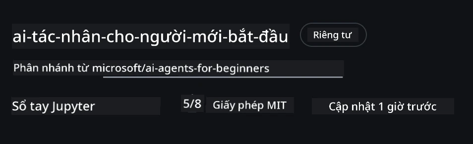
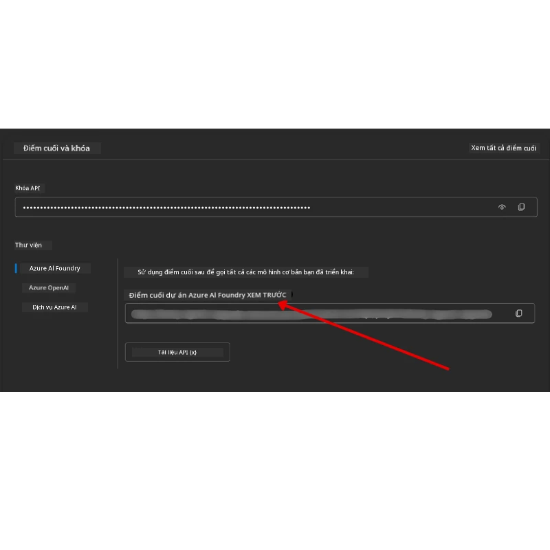

# Thiết lập Khóa học

## Giới thiệu

Bài học này sẽ hướng dẫn cách chạy các ví dụ mã của khóa học này.

## Tham gia cùng các người học khác và nhận trợ giúp

Trước khi bắt đầu sao chép kho lưu trữ của bạn, hãy tham gia kênh [AI Agents For Beginners Discord](https://aka.ms/ai-agents/discord) để nhận trợ giúp về thiết lập, đặt câu hỏi về khóa học hoặc kết nối với các người học khác.

## Sao chép hoặc Fork kho lưu trữ này

Để bắt đầu, vui lòng sao chép hoặc fork kho lưu trữ GitHub. Việc này sẽ tạo phiên bản riêng của bạn cho tài liệu khóa học để bạn có thể chạy, thử nghiệm và tùy chỉnh mã!

Bạn có thể thực hiện bằng cách nhấp vào liên kết <a href="https://github.com/microsoft/ai-agents-for-beginners/fork" target="_blank">fork kho lưu trữ</a>

Bạn sẽ có phiên bản fork của khóa học này tại liên kết sau:



### Shallow Clone (khuyến nghị cho workshop / Codespaces)

  > Kho lưu trữ đầy đủ có thể rất lớn (~3 GB) khi bạn tải xuống toàn bộ lịch sử và tất cả các tập tin. Nếu bạn chỉ tham gia workshop hoặc chỉ cần vài thư mục bài học, một bản shallow clone (hoặc sparse clone) sẽ tránh tải xuống phần lớn bằng cách rút ngắn lịch sử và/hoặc bỏ qua các blob.

#### Shallow clone nhanh — lịch sử tối thiểu, tất cả tập tin

Thay `<your-username>` trong các lệnh dưới đây bằng URL fork của bạn (hoặc URL upstream nếu bạn muốn).

Để sao chép chỉ lịch sử commit mới nhất (tải xuống nhỏ):

```bash|powershell
git clone --depth 1 https://github.com/<your-username>/ai-agents-for-beginners.git
```

Để sao chép một nhánh cụ thể:

```bash|powershell
git clone --depth 1 --branch <branch-name> https://github.com/<your-username>/ai-agents-for-beginners.git
```

#### Clone một phần (sparse) — blob tối thiểu + chỉ các thư mục chọn lọc

Lệnh này sử dụng partial clone và sparse-checkout (yêu cầu Git 2.25+ và khuyến nghị Git hiện đại hỗ trợ partial clone):

```bash|powershell
git clone --depth 1 --filter=blob:none --sparse https://github.com/<your-username>/ai-agents-for-beginners.git
```

Đi vào thư mục repo:

```bash|powershell
cd ai-agents-for-beginners
```

Sau đó chỉ định các thư mục bạn muốn (ví dụ dưới đây cho thấy hai thư mục):

```bash|powershell
git sparse-checkout set 00-course-setup 01-intro-to-ai-agents
```

Sau khi clone và kiểm tra tập tin, nếu bạn chỉ cần các tập tin và muốn giải phóng không gian (không cần lịch sử git), vui lòng xóa dữ liệu metadata repository (💀 không thể khôi phục — bạn sẽ mất toàn bộ chức năng Git: không thể commit, pull, push hoặc truy cập lịch sử).

```bash
# zsh/bash
rm -rf .git
```

```powershell
# PowerShell
Remove-Item -Recurse -Force .git
```

#### Sử dụng GitHub Codespaces (khuyến nghị để tránh tải xuống lớn trên máy)

- Tạo một Codespace mới cho repo này qua [GitHub UI](https://github.com/codespaces).  

- Trong terminal của Codespace mới tạo, chạy một trong các lệnh shallow/sparse clone ở trên để mang chỉ các thư mục bài học bạn cần vào workspace Codespace.
- Tùy chọn: sau khi clone bên trong Codespaces, xóa .git để giải phóng thêm dung lượng (xem các lệnh xóa ở trên).
- Lưu ý: Nếu bạn muốn mở repo trực tiếp trong Codespaces (không clone thêm), lưu ý Codespaces sẽ xây dựng môi trường devcontainer và có thể vẫn cung cấp nhiều hơn mức bạn cần. Clone một bản shallow bên trong Codespace mới cho phép bạn kiểm soát sử dụng ổ đĩa tốt hơn.

#### Mẹo

- Luôn thay URL clone bằng fork của bạn nếu bạn muốn chỉnh sửa/commit.
- Nếu bạn sau này cần nhiều lịch sử hoặc tập tin hơn, bạn có thể fetch hoặc điều chỉnh sparse-checkout để bao gồm thêm thư mục.

## Chạy Mã

Khóa học này cung cấp một loạt các Jupyter Notebooks để bạn có thể chạy để có trải nghiệm thực hành xây dựng các AI Agents.

Mã mẫu sử dụng **Microsoft Agent Framework (MAF)** với `AzureAIProjectAgentProvider`, kết nối đến **Azure AI Agent Service V2** (API Responses) thông qua **Microsoft Foundry**.

Tất cả các notebook Python được gắn nhãn `*-python-agent-framework.ipynb`.

## Yêu cầu

- Python 3.12+
  - **LƯU Ý**: Nếu bạn chưa cài Python3.12, đảm bảo bạn cài đặt nó. Sau đó tạo môi trường ảo venv sử dụng python3.12 để đảm bảo các phiên bản đúng được cài từ tệp requirements.txt.
  
    >Ví dụ

    Tạo thư mục Python venv:

    ```bash|powershell
    python -m venv venv
    ```

    Sau đó kích hoạt môi trường venv cho:

    ```bash
    # zsh/bash
    source venv/bin/activate
    ```
  
    ```dos
    # Command Prompt for Windows
    venv\Scripts\activate
    ```

- .NET 10+: Đối với mã mẫu sử dụng .NET, hãy cài đặt [.NET 10 SDK](https://dotnet.microsoft.com/download/dotnet/10.0) hoặc phiên bản mới hơn. Sau đó kiểm tra phiên bản SDK .NET bạn đã cài đặt:

    ```bash|powershell
    dotnet --list-sdks
    ```

- **Azure CLI** — Yêu cầu để xác thực. Cài tại [aka.ms/installazurecli](https://aka.ms/installazurecli).
- **Azure Subscription** — Để truy cập Microsoft Foundry và Azure AI Agent Service.
- **Microsoft Foundry Project** — Một dự án có mô hình đã được triển khai (ví dụ: `gpt-4o`). Xem [Bước 1](#bước-1-tạo-dự-án-microsoft-foundry) bên dưới.

Chúng tôi đã bao gồm tệp `requirements.txt` ở thư mục gốc của repo chứa tất cả các gói Python cần thiết để chạy mã mẫu.

Bạn có thể cài đặt chúng bằng cách chạy lệnh sau trong terminal ở thư mục gốc repo:

```bash|powershell
pip install -r requirements.txt
```

Chúng tôi khuyên bạn nên tạo môi trường ảo Python để tránh xung đột và sự cố.

## Thiết lập VSCode

Đảm bảo bạn đang dùng đúng phiên bản Python trong VSCode.


## Thiết lập Microsoft Foundry và Azure AI Agent Service

### Bước 1: Tạo Dự án Microsoft Foundry

Bạn cần một **hub** và một **dự án** Azure AI Foundry có mô hình được triển khai để chạy notebook.

1. Vào [ai.azure.com](https://ai.azure.com) và đăng nhập với tài khoản Azure của bạn.
2. Tạo một **hub** (hoặc dùng hub hiện có). Xem: [Tổng quan tài nguyên Hub](https://learn.microsoft.com/azure/ai-foundry/concepts/ai-resources).
3. Trong hub, tạo một **dự án**.
4. Triển khai một mô hình (ví dụ: `gpt-4o`) từ **Models + Endpoints** → **Deploy model**.

### Bước 2: Lấy Endpoint Dự án và Tên Triển khai Mô hình

Từ dự án của bạn trong cổng Microsoft Foundry:

- **Project Endpoint** — Vào trang **Overview** và sao chép URL endpoint.



- **Model Deployment Name** — Vào **Models + Endpoints**, chọn mô hình đã triển khai và ghi chú **Deployment name** (ví dụ: `gpt-4o`).

### Bước 3: Đăng nhập Azure với `az login`

Tất cả notebook dùng **`AzureCliCredential`** để xác thực — không cần quản lý các khóa API. Điều này yêu cầu bạn đăng nhập qua Azure CLI.

1. **Cài Azure CLI** nếu bạn chưa: [aka.ms/installazurecli](https://aka.ms/installazurecli)

2. **Đăng nhập** bằng lệnh:

    ```bash|powershell
    az login
    ```

    Hoặc nếu bạn ở môi trường remote/Codespace không có trình duyệt:

    ```bash|powershell
    az login --use-device-code
    ```

3. **Chọn đăng ký Azure** nếu được yêu cầu — chọn đăng ký chứa dự án Foundry của bạn.

4. **Xác minh** bạn đã đăng nhập:

    ```bash|powershell
    az account show
    ```

> **Tại sao lại `az login`?** Các notebook xác thực thông qua `AzureCliCredential` của gói `azure-identity`. Điều này có nghĩa phiên làm việc Azure CLI của bạn cung cấp thông tin xác thực — không cần API key hay bí mật trong tệp `.env`. Đây là một [thực hành bảo mật tốt](https://learn.microsoft.com/azure/developer/ai/keyless-connections).

### Bước 4: Tạo tệp `.env` của bạn

Sao chép tệp mẫu:

```bash
# zsh/bash
cp .env.example .env
```

```powershell
# PowerShell
Copy-Item .env.example .env
```

Mở `.env` và điền hai giá trị sau:

```env
AZURE_AI_PROJECT_ENDPOINT=https://<your-project>.services.ai.azure.com/api/projects/<your-project-id>
AZURE_AI_MODEL_DEPLOYMENT_NAME=gpt-4o
```

| Biến | Nơi tìm thấy |
|----------|-------------|
| `AZURE_AI_PROJECT_ENDPOINT` | Cổng Foundry → dự án của bạn → trang **Overview** |
| `AZURE_AI_MODEL_DEPLOYMENT_NAME` | Cổng Foundry → **Models + Endpoints** → tên mô hình đã triển khai |

Đó là tất cả cho hầu hết bài học! Các notebook sẽ tự động xác thực qua phiên `az login` của bạn.

### Bước 5: Cài đặt các phụ thuộc Python

```bash|powershell
pip install -r requirements.txt
```

Chúng tôi khuyên bạn nên chạy lệnh này trong môi trường ảo bạn đã tạo trước đó.

## Thiết lập thêm cho Bài học 5 (Agentic RAG)

Bài 5 dùng **Azure AI Search** cho retrieval-augmented generation. Nếu bạn dự định chạy bài này, thêm các biến sau vào tệp `.env`:

| Biến | Nơi tìm thấy |
|-------|---------------|
| `AZURE_SEARCH_SERVICE_ENDPOINT` | Cổng Azure → tài nguyên **Azure AI Search** → **Overview** → URL |
| `AZURE_SEARCH_API_KEY` | Cổng Azure → tài nguyên **Azure AI Search** → **Settings** → **Keys** → key quản trị chính |

## Thiết lập thêm cho Bài học 6 và Bài học 8 (GitHub Models)

Một số notebook trong bài 6 và 8 dùng **GitHub Models** thay vì Azure AI Foundry. Nếu bạn muốn chạy các mẫu đó, thêm các biến này vào tệp `.env`:

| Biến | Nơi tìm thấy |
|---------|--------------|
| `GITHUB_TOKEN` | GitHub → **Settings** → **Developer settings** → **Personal access tokens** |
| `GITHUB_ENDPOINT` | Dùng `https://models.inference.ai.azure.com` (giá trị mặc định) |
| `GITHUB_MODEL_ID` | Tên mô hình sử dụng (ví dụ `gpt-4o-mini`) |

## Nhà cung cấp thay thế: MiniMax (Tương thích OpenAI)

[MiniMax](https://platform.minimaxi.com/) cung cấp các mô hình có ngữ cảnh lớn (lên đến 204K token) thông qua API tương thích OpenAI. Vì Microsoft Agent Framework `OpenAIChatClient` hoạt động với bất kỳ đầu cuối tương thích OpenAI nào, bạn có thể dùng MiniMax như một thay thế cho GitHub Models hoặc OpenAI.

Thêm các biến sau vào tệp `.env`:

| Biến | Nơi tìm thấy |
|--------|--------------|
| `MINIMAX_API_KEY` | [MiniMax Platform](https://platform.minimaxi.com/) → API Keys |
| `MINIMAX_BASE_URL` | Dùng `https://api.minimax.io/v1` (giá trị mặc định) |
| `MINIMAX_MODEL_ID` | Tên mô hình sử dụng (ví dụ: `MiniMax-M2.7`) |

**Các mô hình có sẵn**: `MiniMax-M2.7` (khuyến nghị), `MiniMax-M2.7-highspeed` (phản hồi nhanh hơn)

Các ví dụ mã dùng `OpenAIChatClient` (ví dụ: bài 14 về quy trình đặt phòng khách sạn) sẽ tự động phát hiện và dùng cấu hình MiniMax của bạn khi `MINIMAX_API_KEY` được thiết lập.

## Thiết lập thêm cho Bài học 8 (Quy trình Bing Grounding)

Notebook quy trình có điều kiện trong bài 8 dùng **Bing grounding** qua Azure AI Foundry. Nếu bạn định chạy mẫu này, thêm biến sau vào `.env`:

| Biến | Nơi tìm thấy |
|---------|--------------|
| `BING_CONNECTION_ID` | Cổng Azure AI Foundry → dự án của bạn → **Management** → **Connected resources** → kết nối Bing của bạn → sao chép connection ID |

## Xử lý sự cố

### Lỗi Xác thực chứng chỉ SSL trên macOS

Nếu bạn dùng macOS gặp lỗi như:

```plaintext
ssl.SSLCertVerificationError: [SSL: CERTIFICATE_VERIFY_FAILED] certificate verify failed: self-signed certificate in certificate chain
```

Đây là vấn đề thường gặp với Python trên macOS khi hệ thống không tự động tin cậy chứng chỉ SSL. Thử các giải pháp sau theo thứ tự:

**Lựa chọn 1: Chạy script Cài đặt chứng chỉ của Python (khuyến nghị)**

```bash
# Thay thế 3.XX bằng phiên bản Python bạn đã cài đặt (ví dụ, 3.12 hoặc 3.13):
/Applications/Python\ 3.XX/Install\ Certificates.command
```

**Lựa chọn 2: Dùng `connection_verify=False` trong notebook (chỉ với notebook GitHub Models)**

Trong notebook Bài 6 (`06-building-trustworthy-agents/code_samples/06-system-message-framework.ipynb`), có sẵn phương án giải quyết đã bị comment. Bỏ comment `connection_verify=False` khi tạo client:

```python
client = ChatCompletionsClient(
    endpoint=endpoint,
    credential=AzureKeyCredential(token),
    connection_verify=False,  # Vô hiệu hóa xác thực SSL nếu bạn gặp lỗi chứng chỉ
)
```

> **⚠️ Cảnh báo:** Vô hiệu hóa xác thực SSL (`connection_verify=False`) làm giảm độ bảo mật vì bỏ qua kiểm tra chứng chỉ. Chỉ dùng như giải pháp tạm thời trong môi trường phát triển, không dùng trong sản xuất.

**Lựa chọn 3: Cài và dùng `truststore`**

```bash
pip install truststore
```

Sau đó thêm dòng sau trên đầu notebook hoặc script trước khi gọi network:

```python
import truststore
truststore.inject_into_ssl()
```

## Bị kẹt?  

Nếu bạn gặp sự cố khi chạy thiết lập, hãy tham gia vào <a href="https://discord.gg/kzRShWzttr" target="_blank">Azure AI Community Discord</a> hoặc <a href="https://github.com/microsoft/ai-agents-for-beginners/issues?WT.mc_id=academic-105485-koreyst" target="_blank">tạo một issue</a>.

## Bài học tiếp theo

Bạn giờ đã sẵn sàng chạy mã cho khóa học này. Chúc bạn học vui và tìm hiểu thêm về thế giới các AI Agents!

[Giới thiệu về AI Agents và Các trường hợp sử dụng Agent](../01-intro-to-ai-agents/README.md)

---

<!-- CO-OP TRANSLATOR DISCLAIMER START -->
**Tuyên bố từ chối trách nhiệm**:  
Tài liệu này đã được dịch bằng dịch vụ dịch thuật AI [Co-op Translator](https://github.com/Azure/co-op-translator). Mặc dù chúng tôi cố gắng đảm bảo độ chính xác, xin lưu ý rằng các bản dịch tự động có thể chứa lỗi hoặc không chính xác. Tài liệu gốc bằng ngôn ngữ bản địa nên được coi là nguồn thông tin chính thức. Đối với các thông tin quan trọng, khuyến nghị sử dụng dịch vụ dịch thuật chuyên nghiệp do con người thực hiện. Chúng tôi không chịu trách nhiệm cho bất kỳ sự hiểu lầm hoặc giải thích sai nào phát sinh từ việc sử dụng bản dịch này.
<!-- CO-OP TRANSLATOR DISCLAIMER END -->