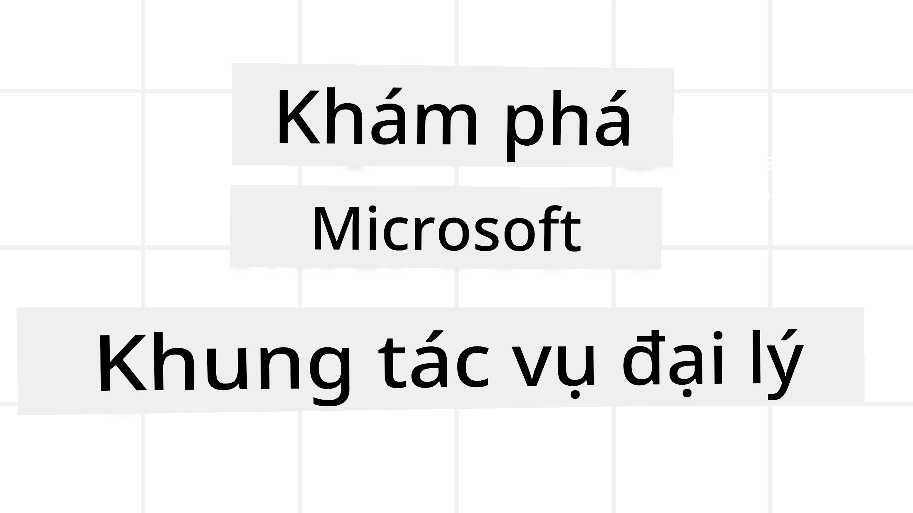

# Khám Phá Microsoft Agent Framework



### Giới thiệu

Bài học này sẽ bao gồm:

- Hiểu về Microsoft Agent Framework: Các tính năng chính và giá trị  
- Khám phá các khái niệm chính của Microsoft Agent Framework
- Các mẫu nâng cao của MAF: Quy trình làm việc, Middleware và Bộ nhớ

## Mục tiêu học tập

Sau khi hoàn thành bài học này, bạn sẽ biết cách:

- Xây dựng các Agent AI sẵn sàng triển khai bằng Microsoft Agent Framework
- Áp dụng các tính năng cốt lõi của Microsoft Agent Framework vào các trường hợp sử dụng Agentic của bạn
- Sử dụng các mẫu nâng cao bao gồm quy trình làm việc, middleware, và khả năng quan sát

## Mẫu mã nguồn

Mẫu mã nguồn cho [Microsoft Agent Framework (MAF)](https://aka.ms/ai-agents-beginners/agent-framewrok) có thể được tìm thấy trong kho lưu trữ này dưới các tệp `xx-python-agent-framework` và `xx-dotnet-agent-framework`.

## Hiểu về Microsoft Agent Framework


[Microsoft Agent Framework (MAF)](https://aka.ms/ai-agents-beginners/agent-framewrok) là framework thống nhất của Microsoft để xây dựng các AI agent. Nó cung cấp sự linh hoạt để giải quyết nhiều trường hợp sử dụng agentic đa dạng được thấy trong môi trường sản xuất và nghiên cứu bao gồm:

- **Điều phối tuần tự của agent** trong các kịch bản cần các quy trình làm việc từng bước.
- **Điều phối đồng thời** trong các kịch bản các agent cần hoàn thành nhiệm vụ cùng lúc.
- **Điều phối nhóm chat** trong các kịch bản các agent có thể hợp tác cùng nhau để thực hiện một nhiệm vụ.
- **Điều phối chuyển giao** trong các kịch bản các agent chuyển giao nhiệm vụ cho nhau khi các nhiệm vụ con được hoàn thành.
- **Điều phối Nam châm** trong các kịch bản một agent quản lý tạo và sửa đổi danh sách nhiệm vụ và xử lý việc phối hợp các subagent để hoàn thành nhiệm vụ.

Để triển khai AI Agents trong Sản xuất, MAF cũng bao gồm các tính năng cho:

- **Khả năng quan sát** thông qua việc sử dụng OpenTelemetry nơi mọi hành động của AI Agent bao gồm gọi công cụ, các bước điều phối, luồng suy luận và giám sát hiệu năng thông qua các bảng điều khiển Microsoft Foundry.
- **Bảo mật** bằng cách lưu trữ agents bản địa trên Microsoft Foundry với các kiểm soát bảo mật như truy cập theo vai trò, xử lý dữ liệu riêng tư và an toàn nội dung tích hợp sẵn.
- **Tính bền bỉ** khi các luồng agent và quy trình làm việc có thể tạm dừng, tiếp tục và phục hồi sau lỗi giúp cho các quy trình chạy lâu dài.
- **Kiểm soát** khi các quy trình làm việc với con người trong vòng lặp được hỗ trợ, nơi các nhiệm vụ được đánh dấu yêu cầu phê duyệt của con người.

Microsoft Agent Framework cũng tập trung vào tính khả chuyển bằng cách:

- **Không phụ thuộc vào đám mây** - Agents có thể chạy trong container, tại chỗ và trên nhiều đám mây khác nhau.
- **Không phụ thuộc nhà cung cấp** - Agents có thể được tạo qua SDK bạn ưa thích bao gồm Azure OpenAI và OpenAI.
- **Tích hợp các chuẩn mở** - Agents có thể sử dụng các giao thức như Agent-to-Agent (A2A) và Model Context Protocol (MCP) để phát hiện và sử dụng các agent và công cụ khác.
- **Plugin và Kết nối** - Có thể kết nối tới dữ liệu và dịch vụ bộ nhớ như Microsoft Fabric, SharePoint, Pinecone và Qdrant.

Hãy cùng xem cách các tính năng này được áp dụng vào một số khái niệm cốt lõi của Microsoft Agent Framework.

## Khái niệm chính của Microsoft Agent Framework

### Agents


**Tạo Agents**

Việc tạo agent được thực hiện bằng cách định nghĩa dịch vụ suy luận (Nhà cung cấp LLM), một  
bộ hướng dẫn cho AI Agent tuân theo, và một `name` được gán:

```python
agent = AzureOpenAIChatClient(credential=AzureCliCredential()).create_agent( instructions="You are good at recommending trips to customers based on their preferences.", name="TripRecommender" )
```

Phía trên sử dụng `Azure OpenAI` nhưng agent có thể được tạo bằng nhiều dịch vụ khác bao gồm `Microsoft Foundry Agent Service`:

```python
AzureAIAgentClient(async_credential=credential).create_agent( name="HelperAgent", instructions="You are a helpful assistant." ) as agent
```

API OpenAI `Responses`, `ChatCompletion`

```python
agent = OpenAIResponsesClient().create_agent( name="WeatherBot", instructions="You are a helpful weather assistant.", )
```

```python
agent = OpenAIChatClient().create_agent( name="HelpfulAssistant", instructions="You are a helpful assistant.", )
```

hoặc [MiniMax](https://platform.minimaxi.com/), cung cấp API tương thích OpenAI với cửa sổ ngữ cảnh lớn (lên đến 204K tokens):

```python
agent = OpenAIChatClient(base_url="https://api.minimax.io/v1", api_key=os.environ["MINIMAX_API_KEY"], model_id="MiniMax-M2.7").create_agent( name="HelpfulAssistant", instructions="You are a helpful assistant.", )
```

hoặc agents từ xa sử dụng giao thức A2A:

```python
agent = A2AAgent( name=agent_card.name, description=agent_card.description, agent_card=agent_card, url="https://your-a2a-agent-host" )
```

**Chạy Agents**

Agents được chạy bằng các phương thức `.run` hoặc `.run_stream` dành cho phản hồi không streaming hoặc streaming.

```python
result = await agent.run("What are good places to visit in Amsterdam?")
print(result.text)
```

```python
async for update in agent.run_stream("What are the good places to visit in Amsterdam?"):
    if update.text:
        print(update.text, end="", flush=True)

```

Mỗi lần chạy agent cũng có thể gồm các tùy chọn để tùy chỉnh các tham số như `max_tokens` được agent sử dụng, `tools` mà agent có thể gọi, và thậm chí `model` dùng cho agent.

Điều này hữu ích trong các trường hợp cần sử dụng các mô hình hoặc công cụ cụ thể để hoàn thành nhiệm vụ của người dùng.

**Công cụ (Tools)**

Công cụ có thể được định nghĩa khi định nghĩa agent:

```python
def get_attractions( location: Annotated[str, Field(description="The location to get the top tourist attractions for")], ) -> str: """Get the top tourist attractions for a given location.""" return f"The top attractions for {location} are." 


# Khi tạo một ChatAgent trực tiếp

agent = ChatAgent( chat_client=OpenAIChatClient(), instructions="You are a helpful assistant", tools=[get_attractions]

```

và cũng khi chạy agent:

```python

result1 = await agent.run( "What's the best place to visit in Seattle?", tools=[get_attractions] # Công cụ chỉ được cung cấp cho lần chạy này )
```

**Luồng Agent (Agent Threads)**

Luồng Agent được dùng để xử lý các cuộc hội thoại nhiều lượt. Luồng có thể được tạo bằng cách:

- Sử dụng `get_new_thread()` cho phép luồng được lưu trữ theo thời gian
- Tạo luồng tự động khi chạy agent và chỉ tồn tại trong lượt chạy hiện tại.

Để tạo luồng, mã nguồn như sau:

```python
# Tạo một luồng mới.
thread = agent.get_new_thread() # Chạy đại lý với luồng.
response = await agent.run("Hello, I am here to help you book travel. Where would you like to go?", thread=thread)

```

Bạn có thể tuần tự hóa luồng để lưu trữ dùng sau:

```python
# Tạo một luồng mới.
thread = agent.get_new_thread() 

# Chạy đại lý với luồng.

response = await agent.run("Hello, how are you?", thread=thread) 

# Tuần tự hóa luồng để lưu trữ.

serialized_thread = await thread.serialize() 

# Giải tuần tự trạng thái luồng sau khi tải từ lưu trữ.

resumed_thread = await agent.deserialize_thread(serialized_thread)
```

**Middleware của Agent**

Agents tương tác với công cụ và LLM để hoàn thành nhiệm vụ người dùng. Trong một số trường hợp, chúng ta muốn thực thi hoặc theo dõi giữa các tương tác này. Middleware của Agent cho phép làm điều này thông qua:

*Middleware Hàm*

Middleware này cho phép thực thi một hành động giữa agent và một hàm/công cụ mà nó sẽ gọi. Một ví dụ khi dùng middleware này là khi bạn muốn ghi lại nhật ký các cuộc gọi hàm.

Trong mã dưới đây `next` xác định middleware tiếp theo hoặc hàm thực tế nên được gọi.

```python
async def logging_function_middleware(
    context: FunctionInvocationContext,
    next: Callable[[FunctionInvocationContext], Awaitable[None]],
) -> None:
    """Function middleware that logs function execution."""
    # Tiền xử lý: Ghi nhật ký trước khi thực thi hàm
    print(f"[Function] Calling {context.function.name}")

    # Tiếp tục tới middleware hoặc thực thi hàm tiếp theo
    await next(context)

    # Hậu xử lý: Ghi nhật ký sau khi thực thi hàm
    print(f"[Function] {context.function.name} completed")
```

*Middleware Chat*

Middleware này cho phép thực thi hoặc ghi lại một hành động giữa agent và các yêu cầu giữa LLM.

Điều này chứa thông tin quan trọng như `messages` được gửi tới dịch vụ AI.

```python
async def logging_chat_middleware(
    context: ChatContext,
    next: Callable[[ChatContext], Awaitable[None]],
) -> None:
    """Chat middleware that logs AI interactions."""
    # Tiền xử lý: Ghi nhật ký trước khi gọi AI
    print(f"[Chat] Sending {len(context.messages)} messages to AI")

    # Tiếp tục đến middleware hoặc dịch vụ AI tiếp theo
    await next(context)

    # Hậu xử lý: Ghi nhật ký sau khi nhận phản hồi từ AI
    print("[Chat] AI response received")

```

**Bộ nhớ của Agent**

Như đã đề cập trong bài học `Agentic Memory`, bộ nhớ là yếu tố quan trọng để agent hoạt động trên các ngữ cảnh khác nhau. MAF cung cấp nhiều loại bộ nhớ khác nhau:

*Bộ nhớ trong luồng (In-Memory Storage)*

Đây là bộ nhớ được lưu trong các luồng trong thời gian chạy ứng dụng.

```python
# Tạo một luồng mới.
thread = agent.get_new_thread() # Chạy tác nhân với luồng.
response = await agent.run("Hello, I am here to help you book travel. Where would you like to go?", thread=thread)
```

*Tin nhắn lâu dài (Persistent Messages)*

Bộ nhớ này dùng để lưu lịch sử hội thoại qua các phiên khác nhau. Nó được định nghĩa bằng `chat_message_store_factory`:

```python
from agent_framework import ChatMessageStore

# Tạo một kho lưu trữ tin nhắn tùy chỉnh
def create_message_store():
    return ChatMessageStore()

agent = ChatAgent(
    chat_client=OpenAIChatClient(),
    instructions="You are a Travel assistant.",
    chat_message_store_factory=create_message_store
)

```

*Bộ nhớ động (Dynamic Memory)*

Bộ nhớ này được thêm vào ngữ cảnh trước khi agent được chạy. Những bộ nhớ này có thể lưu trong dịch vụ bên ngoài như mem0:

```python
from agent_framework.mem0 import Mem0Provider

# Sử dụng Mem0 cho các khả năng bộ nhớ nâng cao
memory_provider = Mem0Provider(
    api_key="your-mem0-api-key",
    user_id="user_123",
    application_id="my_app"
)

agent = ChatAgent(
    chat_client=OpenAIChatClient(),
    instructions="You are a helpful assistant with memory.",
    context_providers=memory_provider
)

```

**Khả năng quan sát của Agent**

Khả năng quan sát rất quan trọng để xây dựng các hệ thống agentic đáng tin cậy và dễ bảo trì. MAF tích hợp với OpenTelemetry để cung cấp tracing và meters cho khả năng quan sát tốt hơn.

```python
from agent_framework.observability import get_tracer, get_meter

tracer = get_tracer()
meter = get_meter()
with tracer.start_as_current_span("my_custom_span"):
    # làm gì đó
    pass
counter = meter.create_counter("my_custom_counter")
counter.add(1, {"key": "value"})
```

### Quy trình làm việc (Workflows)

MAF cung cấp các quy trình làm việc là các bước được định nghĩa trước để hoàn thành một nhiệm vụ và có các agent AI như thành phần trong các bước đó.

Quy trình làm việc bao gồm các thành phần khác nhau cho phép kiểm soát luồng tốt hơn. Quy trình làm việc cũng hỗ trợ **điều phối đa agent** và **kiểm điểm (checkpointing)** để lưu trạng thái quy trình.

Các thành phần chính của quy trình làm việc bao gồm:

**Executor**

Executor nhận các thông điệp đầu vào, thực hiện nhiệm vụ được giao, và sau đó tạo ra một thông điệp đầu ra. Điều này đẩy quy trình về phía hoàn thành nhiệm vụ lớn hơn. Executor có thể là agent AI hoặc logic tùy chỉnh.

**Edges**

Edges dùng để định nghĩa luồng thông điệp trong quy trình làm việc. Các loại edges gồm:

*Edges trực tiếp* - Kết nối đơn giản một-một giữa các executor:

```python
from agent_framework import WorkflowBuilder

builder = WorkflowBuilder()
builder.add_edge(source_executor, target_executor)
builder.set_start_executor(source_executor)
workflow = builder.build()
```

*Edges có điều kiện* - Kích hoạt khi một điều kiện nào đó được đáp ứng. Ví dụ, khi phòng khách sạn không còn, executor có thể đề xuất các lựa chọn khác.

*Edges chuyển đổi theo điều kiện (Switch-case)* - Định tuyến thông điệp đến các executor khác nhau dựa trên các điều kiện đã định nghĩa. Ví dụ, nếu khách du lịch có quyền truy cập ưu tiên, nhiệm vụ của họ sẽ được xử lý qua một quy trình làm việc khác.

*Edges phân nhánh ra (Fan-out)* - Gửi một thông điệp tới nhiều mục tiêu.

*Edges tập hợp vào (Fan-in)* - Thu thập nhiều thông điệp từ các executor khác nhau và gửi đến một mục tiêu.

**Sự kiện (Events)**

Để cung cấp khả năng quan sát tốt hơn vào các quy trình, MAF cung cấp các sự kiện tích hợp sẵn cho việc thực thi bao gồm:

- `WorkflowStartedEvent`  - Bắt đầu thực thi quy trình làm việc
- `WorkflowOutputEvent` - Quy trình làm việc tạo ra đầu ra
- `WorkflowErrorEvent` - Quy trình làm việc gặp lỗi
- `ExecutorInvokeEvent`  - Executor bắt đầu xử lý
- `ExecutorCompleteEvent`  -  Executor hoàn thành xử lý
- `RequestInfoEvent` - Một yêu cầu được phát hành

## Các mẫu nâng cao của MAF

Phần trên đã bao gồm các khái niệm chính của Microsoft Agent Framework. Khi bạn xây dựng các agent phức tạp hơn, đây là một số mẫu nâng cao nên xem xét:

- **Kết hợp Middleware**: Ghép nối nhiều handler middleware (ghi log, xác thực, giới hạn tốc độ) sử dụng middleware hàm và chat để kiểm soát hành vi agent chi tiết.
- **Kiểm điểm quy trình làm việc**: Sử dụng sự kiện quy trình làm việc và tuần tự hóa để lưu và tiếp tục các quy trình agent chạy lâu dài.
- **Lựa chọn công cụ động**: Kết hợp RAG theo mô tả công cụ với đăng ký công cụ của MAF để chỉ trình bày các công cụ phù hợp cho mỗi truy vấn.
- **Chuyển giao đa agent**: Sử dụng các edges trong quy trình làm việc và định tuyến có điều kiện để điều phối chuyển giao giữa các agent chuyên biệt.

## Mẫu mã nguồn

Mẫu mã nguồn cho Microsoft Agent Framework có thể được tìm thấy trong kho lưu trữ này dưới các tệp `xx-python-agent-framework` và `xx-dotnet-agent-framework`.

## Có thêm câu hỏi về Microsoft Agent Framework?

Tham gia [Microsoft Foundry Discord](https://aka.ms/ai-agents/discord) để gặp gỡ các học viên khác, tham dự giờ hành chính và nhận câu trả lời cho các câu hỏi về AI Agents.

---

<!-- CO-OP TRANSLATOR DISCLAIMER START -->
**Tuyên bố từ chối trách nhiệm**:  
Tài liệu này đã được dịch bằng dịch vụ dịch thuật AI [Co-op Translator](https://github.com/Azure/co-op-translator). Mặc dù chúng tôi nỗ lực đảm bảo độ chính xác, xin lưu ý rằng các bản dịch tự động có thể chứa lỗi hoặc thiếu sót. Văn bản gốc bằng ngôn ngữ gốc nên được coi là nguồn chính xác và uy tín. Đối với thông tin quan trọng, nên sử dụng dịch vụ dịch thuật chuyên nghiệp do con người thực hiện. Chúng tôi không chịu trách nhiệm đối với bất kỳ sự hiểu nhầm hoặc diễn giải sai nào phát sinh từ việc sử dụng bản dịch này.
<!-- CO-OP TRANSLATOR DISCLAIMER END -->