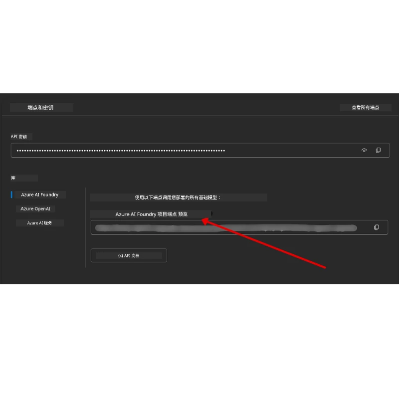

# 课程设置

## 介绍

本课将讲解如何运行本课程的代码示例。

## 加入其他学习者并获取帮助

在开始克隆你的仓库之前，请加入[AI Agents For Beginners Discord频道](https://aka.ms/ai-agents/discord)，以获得安装帮助、课程相关问题解答，或与其他学习者交流。

## 克隆或分叉此仓库

首先，请克隆或分叉此 GitHub 仓库。这样你就拥有了课程材料的个人版本，可以运行、测试并调整代码！

你可以点击以下链接 <a href="https://github.com/microsoft/ai-agents-for-beginners/fork" target="_blank">分叉仓库</a>

现在你应该拥有自己的课程分叉版本，链接如下：


### 浅克隆（推荐用于研讨会 / Codespaces）

  >完整仓库历史和所有文件下载可能较大（约 3 GB）。如果仅参加研讨会或只需要某些课程文件夹，浅克隆（或稀疏克隆）可以通过截断历史或跳过 blobs 来避免大部分下载。

#### 快速浅克隆 — 最小历史，全部文件

下面命令中的 `<your-username>` 请替换为你的 fork URL（或如果你愿意，也可用上游 URL）。

仅克隆最新提交历史（小型下载）：

```bash|powershell
git clone --depth 1 https://github.com/<your-username>/ai-agents-for-beginners.git
```

克隆特定分支：

```bash|powershell
git clone --depth 1 --branch <branch-name> https://github.com/<your-username>/ai-agents-for-beginners.git
```

#### 部分（稀疏）克隆 — 最小 blobs + 只选定的文件夹

使用部分克隆和稀疏检出（需要 Git 2.25 及以上版本，推荐支持部分克隆的现代 Git）：

```bash|powershell
git clone --depth 1 --filter=blob:none --sparse https://github.com/<your-username>/ai-agents-for-beginners.git
```

进入仓库文件夹：

```bash|powershell
cd ai-agents-for-beginners
```

然后指定你需要的文件夹（下面示例为两个文件夹）：

```bash|powershell
git sparse-checkout set 00-course-setup 01-intro-to-ai-agents
```

克隆并确认文件后，如果你只需要文件且想释放空间（无 Git 历史），请删除仓库元数据（💀不可逆——将失去所有 Git 功能：无法提交、拉取、推送或访问历史）。

```bash
# zsh/bash
rm -rf .git
```

```powershell
# PowerShell
Remove-Item -Recurse -Force .git
```

#### 使用 GitHub Codespaces（推荐以避免本地大文件下载）

- 通过[GitHub UI](https://github.com/codespaces)为此仓库创建新的 Codespace。

- 在新建 Codespace 的终端中运行上述浅克隆或稀疏克隆命令，只将所需课程文件夹引入 Codespace 工作区。
- 可选：在 Codespaces 内克隆后，删除 .git 文件夹释放额外空间（参见上面删除命令）。
- 注意：如果你倾向于直接打开仓库至 Codespaces（无额外克隆），请知悉 Codespaces 将构建 devcontainer 环境，可能仍会预置超出需求的内容。在新 Codespace 内浅克隆副本，能更好控制磁盘使用。

#### 小贴士

- 如果你想编辑或提交代码，请务必替换克隆 URL 为你的 fork。
- 之后若需更多历史或文件，可通过拉取或调整稀疏检出包含额外文件夹。

## 运行代码

本课程提供一系列 Jupyter 笔记本，供你运行以获得构建 AI 代理的动手体验。

代码示例使用了 **Microsoft Agent Framework (MAF)** 中的 `AzureAIProjectAgentProvider`，它通过 **Microsoft Foundry** 连接到 **Azure AI Agent Service V2**（即 Responses API）。

所有 Python 笔记本均标注为 `*-python-agent-framework.ipynb`。

## 要求

- Python 3.12+
  - <strong>注意</strong>：如果尚未安装 Python3.12，请务必先安装。然后使用 python3.12 创建虚拟环境，确保正确安装 requirements.txt 中指定的版本。
  
    >示例

    创建 Python 虚拟环境目录：

    ```bash|powershell
    python -m venv venv
    ```

    激活虚拟环境：

    ```bash
    # zsh/bash
    source venv/bin/activate
    ```
  
    ```dos
    # Command Prompt for Windows
    venv\Scripts\activate
    ```

- .NET 10+: 对于使用 .NET 的示例代码，请确保安装 [.NET 10 SDK](https://dotnet.microsoft.com/download/dotnet/10.0) 或更高版本。检查已安装的 .NET SDK 版本：

    ```bash|powershell
    dotnet --list-sdks
    ```

- **Azure CLI** — 需要进行身份认证。安装地址为 [aka.ms/installazurecli](https://aka.ms/installazurecli)。
- **Azure 订阅** — 用于访问 Microsoft Foundry 和 Azure AI Agent Service。
- **Microsoft Foundry 项目** — 包含已部署模型的项目（如 `gpt-4o`）。请参见下面的[步骤 1](#第1步：创建-microsoft-foundry-项目)。

仓库根目录含有一个 `requirements.txt` 文件，列出了运行代码示例所需的所有 Python 包。

可以在终端仓库根目录运行以下命令安装：

```bash|powershell
pip install -r requirements.txt
```

建议创建 Python 虚拟环境，避免依赖冲突和问题。

## 配置 VSCode

请确保在 VSCode 中使用正确的 Python 版本。


## 设置 Microsoft Foundry 和 Azure AI Agent Service

### 第1步：创建 Microsoft Foundry 项目

你需要一个 Azure AI Foundry 的 **hub** 和 **project**，并部署了模型，才能运行笔记本。

1. 访问 [ai.azure.com](https://ai.azure.com) 并用你的 Azure 账户登录。
2. 创建一个 **hub**（或使用已有 hub）。参见：[Hub 资源概览](https://learn.microsoft.com/azure/ai-foundry/concepts/ai-resources)。
3. 在 hub 内创建一个 **project**。
4. 部署一个模型（例如 `gpt-4o`），路径为 **Models + Endpoints** → **Deploy model**。

### 第2步：获取项目端点和模型部署名称

在 Microsoft Foundry 门户的项目页面：

- <strong>项目端点</strong> — 转到 **Overview** 页面，复制端点 URL。



- <strong>模型部署名称</strong> — 打开 **Models + Endpoints**，选择你的已部署模型，查看 **Deployment name**（例如 `gpt-4o`）。

### 第3步：使用 `az login` 登录 Azure

所有笔记本通过 **`AzureCliCredential`** 进行身份认证 — 无需管理 API 密钥。前提是你通过 Azure CLI 已登录。

1. 如果尚未安装 Azure CLI，请访问：[aka.ms/installazurecli](https://aka.ms/installazurecli) 安装。

2. 运行登录命令：

    ```bash|powershell
    az login
    ```

    如果你处于无浏览器的远程或 Codespace 环境：

    ```bash|powershell
    az login --use-device-code
    ```

3. 如果要求，选择包含 Foundry 项目订阅的 Azure 订阅。

4. 验证登录状态：

    ```bash|powershell
    az account show
    ```

> **为什么使用 `az login`？** 笔记本采用来自 `azure-identity` 包的 `AzureCliCredential` 进行认证。这意味着凭证由 Azure CLI 会话提供，`.env` 文件中无需 API 密钥或密钥。这是[安全最佳实践](https://learn.microsoft.com/azure/developer/ai/keyless-connections)。

### 第4步：创建 `.env` 文件

复制示例文件：

```bash
# zsh/bash
cp .env.example .env
```

```powershell
# PowerShell
Copy-Item .env.example .env
```

打开 `.env`，填写下列两个值：

```env
AZURE_AI_PROJECT_ENDPOINT=https://<your-project>.services.ai.azure.com/api/projects/<your-project-id>
AZURE_AI_MODEL_DEPLOYMENT_NAME=gpt-4o
```

| 变量名 | 获取位置 |
|----------|-----------------|
| `AZURE_AI_PROJECT_ENDPOINT` | Foundry 门户 → 你的项目 → **Overview** 页面 |
| `AZURE_AI_MODEL_DEPLOYMENT_NAME` | Foundry 门户 → **Models + Endpoints** → 已部署模型名称 |

完成此步骤后，大部分课程的笔记本将通过你的 `az login` 会话自动完成认证。

### 第5步：安装 Python 依赖

```bash|powershell
pip install -r requirements.txt
```

建议在之前创建的虚拟环境里执行该命令。

## 第5课附加设置（Agentic RAG）

第5课使用 **Azure AI Search** 进行检索增强生成。如需运行本课，请将以下变量添加到 `.env` 文件：

| 变量名 | 获取位置 |
|----------|-----------------|
| `AZURE_SEARCH_SERVICE_ENDPOINT` | Azure 门户 → 你的 **Azure AI Search** 资源 → **Overview** → URL |
| `AZURE_SEARCH_API_KEY` | Azure 门户 → 你的 **Azure AI Search** 资源 → **Settings** → **Keys** → 主管理员密钥 |

## 第6课和第8课附加设置（GitHub 模型）

第6课和第8课部分笔记本使用 **GitHub Models** 替代 Azure AI Foundry。如需运行这些示例，请将以下变量添加至 `.env` 文件：

| 变量名 | 获取位置 |
|----------|-----------------|
| `GITHUB_TOKEN` | GitHub → **Settings** → **Developer settings** → **Personal access tokens** |
| `GITHUB_ENDPOINT` | 使用 `https://models.inference.ai.azure.com`（默认值） |
| `GITHUB_MODEL_ID` | 要使用的模型名称（例如 `gpt-4o-mini`） |

## 替代提供者：MiniMax（兼容 OpenAI）

[MiniMax](https://platform.minimaxi.com/) 通过兼容 OpenAI 的 API 提供大上下文模型（最高 204K tokens）。由于 Microsoft Agent Framework 的 `OpenAIChatClient` 支持任何兼容 OpenAI 的端点，你可以将 MiniMax 作为 GitHub Models 或 OpenAI 的替代方案无缝使用。

将以下变量添加到 `.env` 文件：

| 变量名 | 获取位置 |
|----------|-----------------|
| `MINIMAX_API_KEY` | [MiniMax 平台](https://platform.minimaxi.com/) → API Keys |
| `MINIMAX_BASE_URL` | 使用 `https://api.minimax.io/v1`（默认值） |
| `MINIMAX_MODEL_ID` | 要使用的模型名称（例如 `MiniMax-M2.7`） |

<strong>可用模型</strong>：`MiniMax-M2.7`（推荐）、`MiniMax-M2.7-highspeed`（响应更快）

使用 `OpenAIChatClient` 的代码示例（如第14课酒店预订工作流）在检测到设置了 `MINIMAX_API_KEY` 时，会自动选择 MiniMax 配置。

## 第8课附加设置（Bing Grounding 工作流）

第8课的条件工作流笔记本使用 Azure AI Foundry 的 **Bing grounding**。若要运行此示例，请将以下变量添加到 `.env` 文件：

| 变量名 | 获取位置 |
|----------|-----------------|
| `BING_CONNECTION_ID` | Azure AI Foundry 门户 → 你的项目 → **Management** → **Connected resources** → 你的 Bing 连接 → 复制连接 ID |

## 故障排除

### macOS 上的 SSL 证书验证错误

如果你在 macOS 遇到如下错误：

```plaintext
ssl.SSLCertVerificationError: [SSL: CERTIFICATE_VERIFY_FAILED] certificate verify failed: self-signed certificate in certificate chain
```

这是 macOS 上 Python 的已知问题，系统 SSL 证书未被自动信任。请按顺序尝试以下解决方案：

**方案1：运行 Python 的 Install Certificates 脚本（推荐）**

```bash
# 用您安装的Python版本替换3.XX（例如，3.12或3.13）：
/Applications/Python\ 3.XX/Install\ Certificates.command
```

**方案2：在笔记本中使用 `connection_verify=False`（仅适用于 GitHub Models 笔记本）**

在第6课笔记本 `06-building-trustworthy-agents/code_samples/06-system-message-framework.ipynb` 中已包含注释掉的解决方案。创建客户端时取消注释 `connection_verify=False`：

```python
client = ChatCompletionsClient(
    endpoint=endpoint,
    credential=AzureKeyCredential(token),
    connection_verify=False,  # 如果遇到证书错误，请禁用 SSL 验证
)
```

> **⚠️ 警告：** 禁用 SSL 验证（`connection_verify=False`）会跳过证书校验，降低安全性。请仅在开发环境作为临时解决方案使用，切勿在生产环境启用。

**方案3：安装并使用 `truststore`**

```bash
pip install truststore
```

然后在笔记本或脚本顶部（进行网络调用前）添加以下内容：

```python
import truststore
truststore.inject_into_ssl()
```

## 遇到困难？

如果遇到任何设置问题，欢迎加入我们的 <a href="https://discord.gg/kzRShWzttr" target="_blank">Azure AI 社区 Discord</a>，或<a href="https://github.com/microsoft/ai-agents-for-beginners/issues?WT.mc_id=academic-105485-koreyst" target="_blank">创建 Issues</a>。

## 下一课

现在你已准备好运行本课程的代码。祝你在 AI 代理的世界里学习愉快！

[AI 代理及其用例介绍](../01-intro-to-ai-agents/README.md)

---

<!-- CO-OP TRANSLATOR DISCLAIMER START -->
**免责声明**：  
本文档使用 AI 翻译服务 [Co-op Translator](https://github.com/Azure/co-op-translator) 进行翻译。虽然我们力求准确，但请注意，自动翻译可能包含错误或不准确之处。以原始语言的文档为权威来源。如涉及重要信息，建议使用专业人工翻译。对于因使用此翻译产生的任何误解或误释，我们概不负责。
<!-- CO-OP TRANSLATOR DISCLAIMER END -->