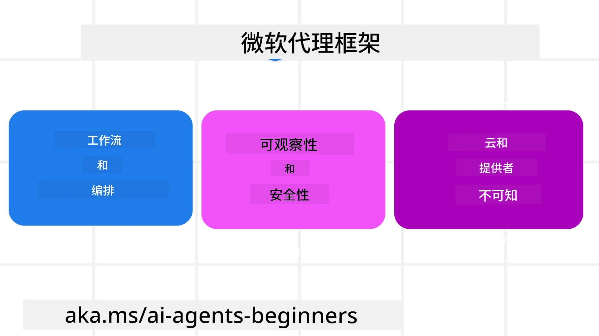
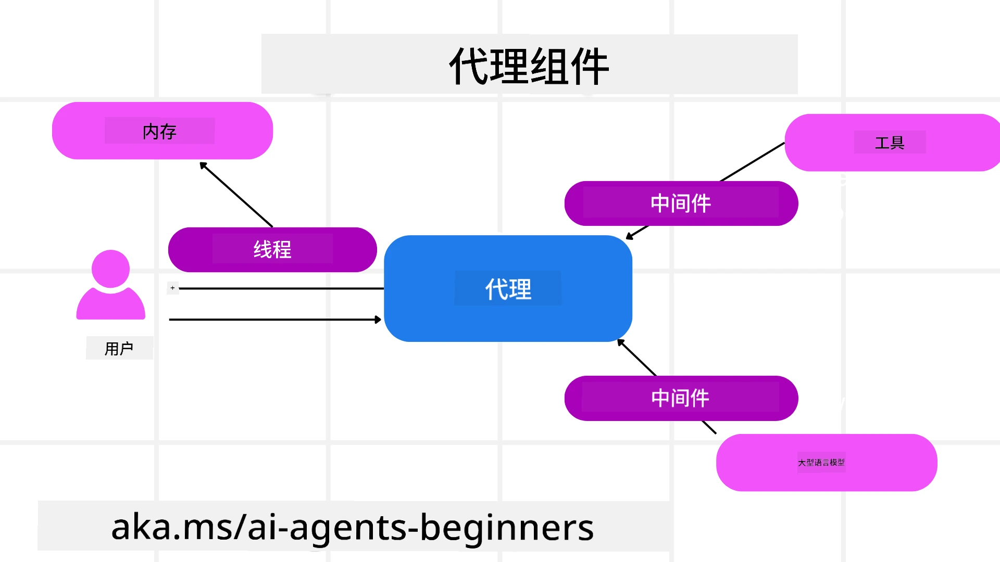

# 探索 Microsoft Agent Framework


### 介绍

本课将涵盖：

- 理解 Microsoft Agent Framework：关键功能和价值  
- 探索 Microsoft Agent Framework 的关键概念
- 高级 MAF 模式：工作流、中间件和内存

## 学习目标

完成本课后，您将了解如何：

- 使用 Microsoft Agent Framework 构建生产就绪的 AI 代理
- 将 Microsoft Agent Framework 的核心功能应用于您的代理用例
- 使用包括工作流、中间件和可观察性在内的高级模式

## 代码示例

[Microsoft Agent Framework (MAF)](https://aka.ms/ai-agents-beginners/agent-framewrok) 的代码示例可以在本仓库的 `xx-python-agent-framework` 和 `xx-dotnet-agent-framework` 文件中找到。

## 理解 Microsoft Agent Framework



[Microsoft Agent Framework (MAF)](https://aka.ms/ai-agents-beginners/agent-framewrok) 是微软用于构建 AI 代理的统一框架。它提供了灵活性，能够应对生产和研究环境中各种代理用例，包括：

- <strong>顺序代理编排</strong>，适用于需要一步步工作流的场景。
- <strong>并发编排</strong>，适用于代理需要同时完成任务的场景。
- <strong>群聊编排</strong>，适用于代理能够协作完成同一任务的场景。
- <strong>交接编排</strong>，适用于代理在子任务完成后相互交接任务的场景。
- <strong>磁性编排</strong>，适用于管理代理创建和修改任务列表，并协调子代理完成任务的场景。

为了在生产中交付 AI 代理，MAF 还包含以下特性：

- <strong>可观察性</strong>，通过 OpenTelemetry 实现，监控 AI 代理的每一步操作，包括工具调用、编排步骤、推理流程以及通过 Microsoft Foundry 仪表板进行性能监控。
- <strong>安全性</strong>，通过在 Microsoft Foundry 本地托管代理，实现基于角色访问、私有数据处理和内置内容安全的安全控制。
- <strong>持久性</strong>，代理线程和工作流可以暂停、恢复并从错误中恢复，支持长时间运行的过程。
- <strong>控制</strong>，支持人机交互工作流，任务可以标记为需要人工审批。

Microsoft Agent Framework 还注重互操作性：

- <strong>云无关性</strong> —— 代理可以运行在容器、本地多云环境中。
- <strong>供应商无关性</strong> —— 代理可以通过包括 Azure OpenAI 和 OpenAI 在内的首选 SDK 创建。
- <strong>集成开放标准</strong> —— 代理可以使用如 Agent-to-Agent (A2A) 和 Model Context Protocol (MCP) 等协议，发现和使用其他代理和工具。
- <strong>插件和连接器</strong> —— 可以连接到数据和内存服务，如 Microsoft Fabric、SharePoint、Pinecone 和 Qdrant。

让我们看看这些功能如何应用于 Microsoft Agent Framework 的核心概念。

## Microsoft Agent Framework 的关键概念

### 代理



<strong>创建代理</strong>

代理创建通过定义推理服务（LLM 提供者）、AI 代理要遵循的一组指令，以及分配的 `name` 完成：

```python
agent = AzureOpenAIChatClient(credential=AzureCliCredential()).create_agent( instructions="You are good at recommending trips to customers based on their preferences.", name="TripRecommender" )
```

上述示例使用的是 `Azure OpenAI`，但代理也可以通过多种服务创建，包括 `Microsoft Foundry Agent Service`：

```python
AzureAIAgentClient(async_credential=credential).create_agent( name="HelperAgent", instructions="You are a helpful assistant." ) as agent
```

OpenAI 的 `Responses`、`ChatCompletion` API

```python
agent = OpenAIResponsesClient().create_agent( name="WeatherBot", instructions="You are a helpful weather assistant.", )
```

```python
agent = OpenAIChatClient().create_agent( name="HelpfulAssistant", instructions="You are a helpful assistant.", )
```

或者 [MiniMax](https://platform.minimaxi.com/)，它提供兼容 OpenAI 的 API，并支持大上下文窗口（最大 204K 令牌）：

```python
agent = OpenAIChatClient(base_url="https://api.minimax.io/v1", api_key=os.environ["MINIMAX_API_KEY"], model_id="MiniMax-M2.7").create_agent( name="HelpfulAssistant", instructions="You are a helpful assistant.", )
```

或者使用 A2A 协议的远程代理：

```python
agent = A2AAgent( name=agent_card.name, description=agent_card.description, agent_card=agent_card, url="https://your-a2a-agent-host" )
```

<strong>运行代理</strong>

使用 `.run` 或 `.run_stream` 方法以非流或流式响应方式运行代理。

```python
result = await agent.run("What are good places to visit in Amsterdam?")
print(result.text)
```

```python
async for update in agent.run_stream("What are the good places to visit in Amsterdam?"):
    if update.text:
        print(update.text, end="", flush=True)

```

每次代理运行还可以自定义选项，如代理使用的 `max_tokens`、代理可调用的 `tools`，甚至代理用的 `model`。

这在需要指定特定模型或工具以完成用户任务时非常有用。

<strong>工具</strong>

工具可以在定义代理时指定：

```python
def get_attractions( location: Annotated[str, Field(description="The location to get the top tourist attractions for")], ) -> str: """Get the top tourist attractions for a given location.""" return f"The top attractions for {location} are." 


# 直接创建 ChatAgent 时

agent = ChatAgent( chat_client=OpenAIChatClient(), instructions="You are a helpful assistant", tools=[get_attractions]

```

也可以在运行代理时指定：

```python

result1 = await agent.run( "What's the best place to visit in Seattle?", tools=[get_attractions] # 此工具仅用于本次运行 )
```

<strong>代理线程</strong>

代理线程用于处理多轮对话。线程可以通过以下方式创建：

- 使用 `get_new_thread()`，允许线程保存以供后续使用
- 在运行代理时自动创建线程，且线程只在当前运行期间存在。

创建线程的代码如下：

```python
# 创建一个新线程。
thread = agent.get_new_thread() # 使用该线程运行代理。
response = await agent.run("Hello, I am here to help you book travel. Where would you like to go?", thread=thread)

```

然后可以对线程进行序列化，以便后续存储：

```python
# 创建一个新线程。
thread = agent.get_new_thread() 

# 使用线程运行代理。

response = await agent.run("Hello, how are you?", thread=thread) 

# 序列化线程以进行存储。

serialized_thread = await thread.serialize() 

# 从存储加载后反序列化线程状态。

resumed_thread = await agent.deserialize_thread(serialized_thread)
```

<strong>代理中间件</strong>

代理与工具和 LLM 交互以完成用户任务。在某些场景中，我们希望在这些交互之间执行或跟踪操作。代理中间件使我们能够通过以下方式实现：

<em>函数中间件</em>

该中间件允许我们在代理和它调用的函数/工具之间执行操作。例如，您可能想在函数调用时进行日志记录。

下面代码中的 `next` 定义是否调用下一个中间件或实际函数。

```python
async def logging_function_middleware(
    context: FunctionInvocationContext,
    next: Callable[[FunctionInvocationContext], Awaitable[None]],
) -> None:
    """Function middleware that logs function execution."""
    # 预处理：函数执行前记录日志
    print(f"[Function] Calling {context.function.name}")

    # 继续执行下一个中间件或函数
    await next(context)

    # 后处理：函数执行后记录日志
    print(f"[Function] {context.function.name} completed")
```

<em>聊天中间件</em>

该中间件允许我们在代理和发送给 LLM 的请求之间执行或记录操作。

这里包含了发往 AI 服务的 `messages` 等重要信息。

```python
async def logging_chat_middleware(
    context: ChatContext,
    next: Callable[[ChatContext], Awaitable[None]],
) -> None:
    """Chat middleware that logs AI interactions."""
    # 预处理：AI调用前记录日志
    print(f"[Chat] Sending {len(context.messages)} messages to AI")

    # 继续到下一个中间件或AI服务
    await next(context)

    # 后处理：AI响应后记录日志
    print("[Chat] AI response received")

```

<strong>代理内存</strong>

如 `Agentic Memory` 课程中所述，内存是使代理能够处理不同上下文的重要元素。MAF 提供了几种不同类型的内存：

<em>内存存储</em>

这是在应用运行时线程中存储的内存。

```python
# 创建一个新线程。
thread = agent.get_new_thread() # 使用该线程运行代理。
response = await agent.run("Hello, I am here to help you book travel. Where would you like to go?", thread=thread)
```

<em>持久消息</em>

用于跨会话存储对话历史。通过 `chat_message_store_factory` 定义：

```python
from agent_framework import ChatMessageStore

# 创建一个自定义消息存储
def create_message_store():
    return ChatMessageStore()

agent = ChatAgent(
    chat_client=OpenAIChatClient(),
    instructions="You are a Travel assistant.",
    chat_message_store_factory=create_message_store
)

```

<em>动态内存</em>

在运行代理之前添加到上下文中的内存。这些内存可以存储在如 mem0 等外部服务：

```python
from agent_framework.mem0 import Mem0Provider

# 使用 Mem0 实现高级内存功能
memory_provider = Mem0Provider(
    api_key="your-mem0-api-key",
    user_id="user_123",
    application_id="my_app"
)

agent = ChatAgent(
    chat_client=OpenAIChatClient(),
    instructions="You are a helpful assistant with memory.",
    context_providers=memory_provider
)

```

<strong>代理可观察性</strong>

可观察性对构建可靠且易维护的代理系统至关重要。MAF 集成 OpenTelemetry，提供跟踪和指标，实现更佳的可观察性。

```python
from agent_framework.observability import get_tracer, get_meter

tracer = get_tracer()
meter = get_meter()
with tracer.start_as_current_span("my_custom_span"):
    # 做某事
    pass
counter = meter.create_counter("my_custom_counter")
counter.add(1, {"key": "value"})
```

### 工作流

MAF 提供预定义步骤的工作流以完成任务，这些步骤中包含 AI 代理作为组件。

工作流由不同组件组成，实现更好的流程控制。工作流还支持 <strong>多代理编排</strong> 和 <strong>检查点</strong>，以保存工作流状态。

工作流的核心组件：

<strong>执行器</strong>

执行器接收输入消息，执行指定任务，然后产生输出消息，推动工作流向完成更大任务迈进。执行器可以是 AI 代理或自定义逻辑。

<strong>边缘</strong>

边缘用于定义工作流中的消息流动。类型包括：

<em>直接边缘</em> - 执行器之间简单的一对一连接：

```python
from agent_framework import WorkflowBuilder

builder = WorkflowBuilder()
builder.add_edge(source_executor, target_executor)
builder.set_start_executor(source_executor)
workflow = builder.build()
```

<em>条件边缘</em> - 在满足某条件后激活。例如，当酒店房间不可用，执行器可以建议其他选项。

*切换-案例边缘* - 根据定义条件将消息路由到不同执行器。例如，若旅行客户享有优先访问，其任务将通过另一个工作流处理。

<em>扇出边缘</em> - 一条消息发送到多个目标。

<em>扇入边缘</em> - 收集来自不同执行器的多条消息并发送到一个目标。

<strong>事件</strong>

为了提供更好的工作流可观察性，MAF 提供了内置执行事件，包括：

- `WorkflowStartedEvent`  - 工作流执行开始
- `WorkflowOutputEvent` - 工作流产生输出
- `WorkflowErrorEvent` - 工作流遇到错误
- `ExecutorInvokeEvent`  - 执行器开始处理
- `ExecutorCompleteEvent`  - 执行器完成处理
- `RequestInfoEvent` - 发出请求

## 高级 MAF 模式

以上部分涵盖了 Microsoft Agent Framework 的关键概念。构建更复杂代理时，可以考虑以下高级模式：

- <strong>中间件组合</strong>：使用函数和聊天中间件链式组合多个中间件处理程序（如日志记录、身份验证、限流），实现对代理行为的细粒度控制。
- <strong>工作流检查点</strong>：利用工作流事件和序列化保存并恢复长时间运行的代理过程。
- <strong>动态工具选择</strong>：结合基于工具描述的 RAG 技术与 MAF 的工具注册功能，实现每次查询仅展示相关工具。
- <strong>多代理交接</strong>：使用工作流边缘和条件路由编排专业代理之间的任务交接。

## 代码示例

Microsoft Agent Framework 的代码示例可以在本仓库的 `xx-python-agent-framework` 和 `xx-dotnet-agent-framework` 文件中找到。

## 有关于 Microsoft Agent Framework 的更多问题？

加入 [Microsoft Foundry Discord](https://aka.ms/ai-agents/discord)，与其他学习者交流，参加办公时间，获取您的 AI 代理问题的解答。

---

<!-- CO-OP TRANSLATOR DISCLAIMER START -->
**免责声明**：  
本文件已通过 AI 翻译服务 [Co-op Translator](https://github.com/Azure/co-op-translator) 进行翻译。虽然我们努力确保准确性，但请注意，自动翻译可能包含错误或不准确之处。原始语言版本的文件应被视为权威来源。对于重要信息，建议使用专业人工翻译。我们对因使用本翻译而产生的任何误解或误释不承担任何责任。
<!-- CO-OP TRANSLATOR DISCLAIMER END -->