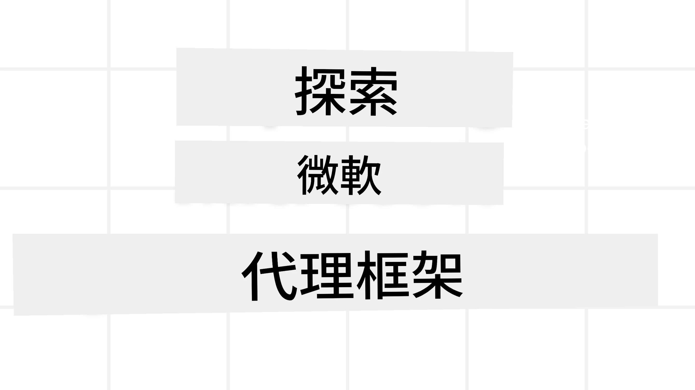
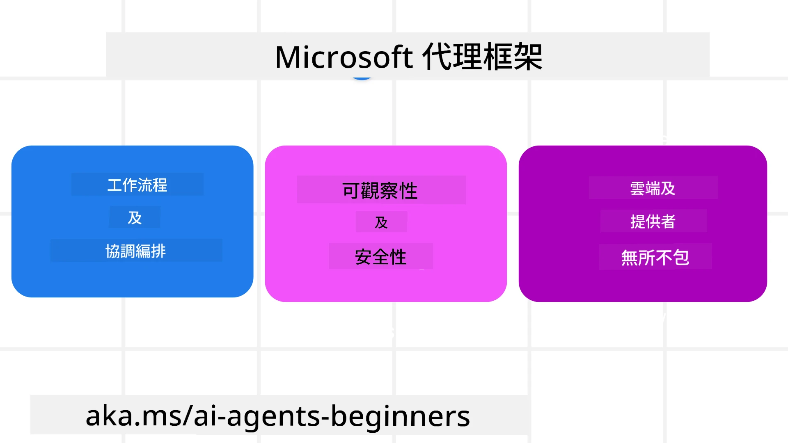
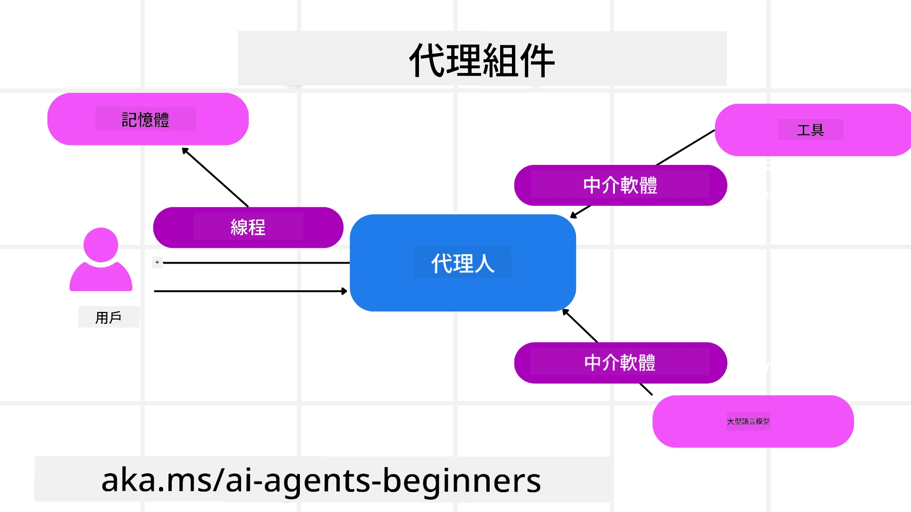

# 探索 Microsoft Agent Framework



### 介紹

本課程將涵蓋：

- 了解 Microsoft Agent Framework：主要特點與價值  
- 探索 Microsoft Agent Framework 的關鍵概念
- 進階 MAF 範式：工作流程、中介軟體與記憶體

## 學習目標

完成本課程後，您將會知道如何：

- 使用 Microsoft Agent Framework 建立生產級的 AI 代理
- 將 Microsoft Agent Framework 的核心功能應用於您的代理使用案例
- 使用包括工作流程、中介軟體與可觀察性在內的進階範式

## 程式碼範例 

[Microsoft Agent Framework (MAF)](https://aka.ms/ai-agents-beginners/agent-framewrok) 的程式碼範例可於此存放庫中的 `xx-python-agent-framework` 和 `xx-dotnet-agent-framework` 檔案中找到。

## 了解 Microsoft Agent Framework



[Microsoft Agent Framework (MAF)](https://aka.ms/ai-agents-beginners/agent-framewrok) 是微軟統一的 AI 代理構建框架。它提供靈活性以應對生產和研究環境中各種代理使用案例，包括：

- <strong>順序代理協同</strong>，適用於需要逐步工作流程的場景。
- <strong>並行協同</strong>，適用於代理需要同時完成任務的場景。
- <strong>群組聊天協同</strong>，適用於代理可共同協作處理單一任務的場景。
- <strong>任務交接協同</strong>，適用於代理在子任務完成後相互交接任務的場景。
- <strong>磁性協同</strong>，經理代理創建並修改任務清單，並協調子代理完成任務的場景。

為了在生產環境交付 AI 代理，MAF 還包含以下功能：

- <strong>可觀察性</strong>，利用 OpenTelemetry 追蹤 AI 代理的每個動作，包括工具調用、協同步驟、推理流程，以及透過 Microsoft Foundry 儀表板進行效能監控。
- <strong>安全性</strong>，代理原生託管於 Microsoft Foundry，包含角色基礎訪問、私有資料處理與內建內容安全控制。
- <strong>持久性</strong>，代理執行緒與工作流程可暫停、繼續和從錯誤中恢復，使可支援較長時間執行流程。
- <strong>控制</strong>，支持人機介入工作流程，任務可標記為需人工核准。

Microsoft Agent Framework 亦重視互操作性：

- <strong>雲端中立</strong> — 代理可在容器、內部部署及多個不同雲端執行。
- <strong>服務廠商中立</strong> — 代理可透過您偏好的 SDK 建立，包括 Azure OpenAI 與 OpenAI。
- <strong>整合開放標準</strong> — 代理能利用 Agent-to-Agent (A2A) 與 Model Context Protocol (MCP) 等協定來發現並使用其他代理和工具。
- <strong>外掛與連接器</strong> — 可連接至 Microsoft Fabric、SharePoint、Pinecone 與 Qdrant 等資料與記憶服務。

現在來看看這些功能如何應用於 Microsoft Agent Framework 的一些核心概念。

## Microsoft Agent Framework 的關鍵概念

### Agents



**建立 Agents**

代理建置是透過定義推論服務（LLM 提供者）、一組 AI 代理需遵循的指令，以及一個指定的 `name` 完成：

```python
agent = AzureOpenAIChatClient(credential=AzureCliCredential()).create_agent( instructions="You are good at recommending trips to customers based on their preferences.", name="TripRecommender" )
```

上述範例使用的是 `Azure OpenAI`，不過代理也可用多種服務建置，包括 `Microsoft Foundry Agent Service`：

```python
AzureAIAgentClient(async_credential=credential).create_agent( name="HelperAgent", instructions="You are a helpful assistant." ) as agent
```

OpenAI 的 `Responses`、`ChatCompletion` API

```python
agent = OpenAIResponsesClient().create_agent( name="WeatherBot", instructions="You are a helpful weather assistant.", )
```

```python
agent = OpenAIChatClient().create_agent( name="HelpfulAssistant", instructions="You are a helpful assistant.", )
```

或 [MiniMax](https://platform.minimaxi.com/)，提供帶大上下文視窗（可達 204K 代幣）的 OpenAI 相容 API：

```python
agent = OpenAIChatClient(base_url="https://api.minimax.io/v1", api_key=os.environ["MINIMAX_API_KEY"], model_id="MiniMax-M2.7").create_agent( name="HelpfulAssistant", instructions="You are a helpful assistant.", )
```

或使用 A2A 協定的遠端代理：

```python
agent = A2AAgent( name=agent_card.name, description=agent_card.description, agent_card=agent_card, url="https://your-a2a-agent-host" )
```

**執行 Agents**

代理執行可透過 `.run` 或 `.run_stream` 方法，分別支援非串流或串流回應。

```python
result = await agent.run("What are good places to visit in Amsterdam?")
print(result.text)
```

```python
async for update in agent.run_stream("What are the good places to visit in Amsterdam?"):
    if update.text:
        print(update.text, end="", flush=True)

```

每次代理執行也可設定選項以自訂參數，如代理可用的 `max_tokens`、`tools` 及所使用的 `model`。

此設定適用於完成使用者任務需特定模型或工具的情況。

**工具 (Tools)**

工具可在定義代理時設定：

```python
def get_attractions( location: Annotated[str, Field(description="The location to get the top tourist attractions for")], ) -> str: """Get the top tourist attractions for a given location.""" return f"The top attractions for {location} are." 


# 當直接建立一個 ChatAgent 時

agent = ChatAgent( chat_client=OpenAIChatClient(), instructions="You are a helpful assistant", tools=[get_attractions]

```

也可在執行代理時指定：

```python

result1 = await agent.run( "What's the best place to visit in Seattle?", tools=[get_attractions] # 只供呢次運行使用嘅工具 )
```

**代理執行緒 (Agent Threads)**

代理執行緒用於處理多輪對話。執行緒可透過以下方式建立：

- 使用 `get_new_thread()`，可使執行緒得以保存使用
- 執行代理時自動建立執行緒，執行緒僅在本次執行期間存在。

建立執行緒的程式碼如下：

```python
# 建立一個新執行緒。
thread = agent.get_new_thread() # 使用該執行緒運行代理。
response = await agent.run("Hello, I am here to help you book travel. Where would you like to go?", thread=thread)

```

您也可將執行緒序列化保存，供日後使用：

```python
# 建立一個新線程。
thread = agent.get_new_thread() 

# 使用該線程運行代理。

response = await agent.run("Hello, how are you?", thread=thread) 

# 將線程序列化以便儲存。

serialized_thread = await thread.serialize() 

# 從儲存中讀取後反序列化線程狀態。

resumed_thread = await agent.deserialize_thread(serialized_thread)
```

**代理中介軟體 (Agent Middleware)**

代理與工具和 LLM 互動以完成使用者任務。在某些情況，我們希望在彼此互動時執行或追蹤動作。代理中介軟體可透過下列方式達成：

<em>函式中介軟體</em>

此中介軟體允許在代理與其將呼叫的函式/工具之間執行動作。應用例如對函式呼叫做日誌紀錄。

下列程式碼中，`next` 定義是否呼叫下一個中介軟體或實際函式。

```python
async def logging_function_middleware(
    context: FunctionInvocationContext,
    next: Callable[[FunctionInvocationContext], Awaitable[None]],
) -> None:
    """Function middleware that logs function execution."""
    # 預處理：函數執行前記錄日誌
    print(f"[Function] Calling {context.function.name}")

    # 繼續執行下一個中間件或函數
    await next(context)

    # 後處理：函數執行後記錄日誌
    print(f"[Function] {context.function.name} completed")
```

<em>聊天中介軟體</em>

此中介軟體允許在代理與 LLM 之間的請求執行動作或紀錄。

其中包含像是發送給 AI 服務的 `messages` 等重要資訊。

```python
async def logging_chat_middleware(
    context: ChatContext,
    next: Callable[[ChatContext], Awaitable[None]],
) -> None:
    """Chat middleware that logs AI interactions."""
    # 預處理：AI 調用前記錄日誌
    print(f"[Chat] Sending {len(context.messages)} messages to AI")

    # 繼續執行下一個中介軟件或 AI 服務
    await next(context)

    # 後處理：AI 回應後記錄日誌
    print("[Chat] AI response received")

```

<strong>代理記憶體</strong>

如「Agentic Memory」課程中提及，記憶體是使代理能操作於不同上下文的重要元素。MAF 提供多種類型的記憶體：

*即時記憶 (In-Memory Storage)*

此記憶保存在執行緒中，於應用執行期間存在。

```python
# 建立一個新執行緒。
thread = agent.get_new_thread() # 使用該執行緒運行代理。
response = await agent.run("Hello, I am here to help you book travel. Where would you like to go?", thread=thread)
```

*持久訊息 (Persistent Messages)*

此記憶用於跨多個會話存儲對話歷史。透過 `chat_message_store_factory` 定義：

```python
from agent_framework import ChatMessageStore

# 創建一個自訂訊息儲存庫
def create_message_store():
    return ChatMessageStore()

agent = ChatAgent(
    chat_client=OpenAIChatClient(),
    instructions="You are a Travel assistant.",
    chat_message_store_factory=create_message_store
)

```

*動態記憶 (Dynamic Memory)*

此記憶在代理執行前加入到上下文中。可存放於如 mem0 等外部服務：

```python
from agent_framework.mem0 import Mem0Provider

# 使用 Mem0 以實現高級記憶體功能
memory_provider = Mem0Provider(
    api_key="your-mem0-api-key",
    user_id="user_123",
    application_id="my_app"
)

agent = ChatAgent(
    chat_client=OpenAIChatClient(),
    instructions="You are a helpful assistant with memory.",
    context_providers=memory_provider
)

```

**代理可觀察性 (Agent Observability)**

可觀察性對建構可靠且可維護的代理系統至關重要。MAF 整合了 OpenTelemetry 提供追蹤與計量功能以加強可觀察性。

```python
from agent_framework.observability import get_tracer, get_meter

tracer = get_tracer()
meter = get_meter()
with tracer.start_as_current_span("my_custom_span"):
    # 做一些事情
    pass
counter = meter.create_counter("my_custom_counter")
counter.add(1, {"key": "value"})
```

### 工作流程 (Workflows)

MAF 提供工作流程，這是用以完成任務的預定義步驟，並將 AI 代理納為這些步驟的組成部分。

工作流程由不同組件組成，以提供更好的控制流程。工作流程亦支援 <strong>多代理協同</strong> 與 <strong>檢查點</strong>，以保存工作流程狀態。

工作流程的核心組件為：

**執行器 (Executors)**

執行器接收輸入訊息、執行被指派的任務，並產生輸出訊息，推動工作流程朝向完成較大任務。執行器可為 AI 代理或自訂邏輯。

**邊 (Edges)**

邊定義工作流程中訊息的流向，可分為：

<em>直接邊</em> — 執行器間的一對一簡單連結：

```python
from agent_framework import WorkflowBuilder

builder = WorkflowBuilder()
builder.add_edge(source_executor, target_executor)
builder.set_start_executor(source_executor)
workflow = builder.build()
```

<em>條件邊</em> — 當滿足特定條件後啟動。例如當旅館房間無空時，執行器可建議其他選項。

<em>開關案例邊</em> — 根據定義條件導向訊息至不同執行器。例如，若旅客有優先權，其任務會透過其他工作流程處理。

<em>分流邊</em> — 將同一訊息發送到多個目標。

<em>合流邊</em> — 收集多個來自不同執行器的訊息並匯集到一個目標。

**事件 (Events)**

為提供更好的工作流程可觀察性，MAF 提供內建的執行事件，包括：

- `WorkflowStartedEvent`  - 工作流程執行開始
- `WorkflowOutputEvent` - 工作流程產生輸出
- `WorkflowErrorEvent` - 工作流程發生錯誤
- `ExecutorInvokeEvent`  - 執行器開始處理
- `ExecutorCompleteEvent`  -  執行器完成處理
- `RequestInfoEvent` - 發出請求

## 進階 MAF 範式

上述章節涵蓋了 Microsoft Agent Framework 的關鍵概念。隨著您建立更複雜的代理，以下為一些可參考的進階範式：

- <strong>中介軟體組合</strong>：透過函式與聊天中介軟體串聯多個中介軟體處理器（日誌、驗證、頻率限制），對代理行為進行細緻控制。
- <strong>工作流程檢查點</strong>：利用工作流程事件與序列化，保存並恢復長時間執行的代理流程。
- <strong>動態工具選擇</strong>：結合工具描述的 RAG 與 MAF 的工具註冊，只顯示每次查詢相關的工具。
- <strong>多代理交接</strong>：使用工作流程邊與條件路由，協同專門化代理間的任務交接。

## 程式碼範例 

Microsoft Agent Framework 的程式碼範例可於此存放庫中的 `xx-python-agent-framework` 和 `xx-dotnet-agent-framework` 檔案中找到。

## 對 Microsoft Agent Framework 還有更多疑問嗎？

加入 [Microsoft Foundry Discord](https://aka.ms/ai-agents/discord)，與其他學習者會面，參加辦公時段並獲得 AI 代理的問題解答。

---

<!-- CO-OP TRANSLATOR DISCLAIMER START -->
**免責聲明**：  
本文件使用 AI 翻譯服務 [Co-op Translator](https://github.com/Azure/co-op-translator) 進行翻譯。雖然我們致力於準確性，但請注意自動翻譯可能包含錯誤或不準確之處。原始文件的母語版本應被視為權威來源。對於關鍵資訊，建議使用專業人工翻譯。我們對因使用本翻譯而引起的任何誤解或誤釋不承擔任何責任。
<!-- CO-OP TRANSLATOR DISCLAIMER END -->