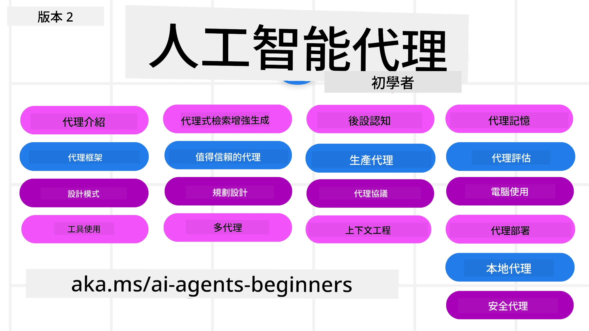

# AI Agents for Beginners - 課程



## 一個教你開始構建 AI Agents 所需知識的課程

[](https://github.com/microsoft/ai-agents-for-beginners/blob/master/LICENSE?WT.mc_id=academic-105485-koreyst)
[](https://GitHub.com/microsoft/ai-agents-for-beginners/graphs/contributors/?WT.mc_id=academic-105485-koreyst)
[](https://GitHub.com/microsoft/ai-agents-for-beginners/issues/?WT.mc_id=academic-105485-koreyst)
[](https://GitHub.com/microsoft/ai-agents-for-beginners/pulls/?WT.mc_id=academic-105485-koreyst)
[](http://makeapullrequest.com?WT.mc_id=academic-105485-koreyst)

### 🌐 多語言支持

#### 透過 GitHub Action 支援（自動且最新）

<!-- CO-OP TRANSLATOR LANGUAGES TABLE START -->
[阿拉伯文](../ar/README.md) | [孟加拉文](../bn/README.md) | [保加利亞文](../bg/README.md) | [緬甸語 (Burmese)](../my/README.md) | [中文 (簡體)](../zh-CN/README.md) | [中文 (繁體，香港)](./README.md) | [中文 (繁體，澳門)](../zh-MO/README.md) | [中文 (繁體，台灣)](../zh-TW/README.md) | [克羅地亞文](../hr/README.md) | [捷克文](../cs/README.md) | [丹麥文](../da/README.md) | [荷蘭文](../nl/README.md) | [愛沙尼亞文](../et/README.md) | [芬蘭文](../fi/README.md) | [法文](../fr/README.md) | [德文](../de/README.md) | [希臘文](../el/README.md) | [希伯來文](../he/README.md) | [印地文](../hi/README.md) | [匈牙利文](../hu/README.md) | [印尼文](../id/README.md) | [意大利文](../it/README.md) | [日文](../ja/README.md) | [坎納達文](../kn/README.md) | [高棉語 (Khmer)](../km/README.md) | [韓文](../ko/README.md) | [立陶宛文](../lt/README.md) | [馬來文](../ms/README.md) | [馬拉雅拉姆文](../ml/README.md) | [馬拉地文](../mr/README.md) | [尼泊爾文](../ne/README.md) | [奈及利亞皮欽語](../pcm/README.md) | [挪威文](../no/README.md) | [波斯文 (Farsi)](../fa/README.md) | [波蘭文](../pl/README.md) | [葡萄牙文 (巴西)](../pt-BR/README.md) | [葡萄牙文 (葡萄牙)](../pt-PT/README.md) | [旁遮普文 (Gurmukhi)](../pa/README.md) | [羅馬尼亞文](../ro/README.md) | [俄文](../ru/README.md) | [塞爾維亞文 (西里爾字母)](../sr/README.md) | [斯洛伐克文](../sk/README.md) | [斯洛文尼亞文](../sl/README.md) | [西班牙文](../es/README.md) | [斯瓦希里文](../sw/README.md) | [瑞典文](../sv/README.md) | [他加祿文 (菲律賓語)](../tl/README.md) | [泰米爾文](../ta/README.md) | [泰盧固文](../te/README.md) | [泰文](../th/README.md) | [土耳其文](../tr/README.md) | [烏克蘭文](../uk/README.md) | [烏爾都文](../ur/README.md) | [越南文](../vi/README.md)

> **想本地端克隆嗎？**
>
> 此存儲庫包含超過 50 種語言翻譯，會大幅增加下載大小。要克隆不包含翻譯的版本，請使用稀疏檢出：
>
> **Bash / macOS / Linux:**
> ```bash
> git clone --filter=blob:none --sparse https://github.com/microsoft/ai-agents-for-beginners.git
> cd ai-agents-for-beginners
> git sparse-checkout set --no-cone '/*' '!translations' '!translated_images'
> ```
>
> **CMD (Windows):**
> ```cmd
> git clone --filter=blob:none --sparse https://github.com/microsoft/ai-agents-for-beginners.git
> cd ai-agents-for-beginners
> git sparse-checkout set --no-cone "/*" "!translations" "!translated_images"
> ```
>
> 這樣可以讓你快速下載完課程所需所有內容。
<!-- CO-OP TRANSLATOR LANGUAGES TABLE END -->

**如果你想增加支援的翻譯語言，請見 [這裡](https://github.com/Azure/co-op-translator/blob/main/getting_started/supported-languages.md)**

[](https://GitHub.com/microsoft/ai-agents-for-beginners/watchers/?WT.mc_id=academic-105485-koreyst)
[](https://GitHub.com/microsoft/ai-agents-for-beginners/network/?WT.mc_id=academic-105485-koreyst)
[](https://GitHub.com/microsoft/ai-agents-for-beginners/stargazers/?WT.mc_id=academic-105485-koreyst)

[](https://discord.gg/nTYy5BXMWG)


## 🌱 開始吧

此課程涵蓋構建 AI Agents 的基礎知識。每課涵蓋不同主題，隨你喜歡從任何課程開始！

此課程支援多種語言。請見我們的[可用語言列表](#-multi-language-support)。

如果你是第一次使用生成式 AI 模型建構，請參考我們的[初學者生成式 AI 課程](https://aka.ms/genai-beginners)，內含 21 節建構生成式 AI 的課程。

別忘了幫此 repo [點星 (🌟)](https://docs.github.com/en/get-started/exploring-projects-on-github/saving-repositories-with-stars?WT.mc_id=academic-105485-koreyst)並[分叉此 repo](https://github.com/microsoft/ai-agents-for-beginners/fork)來執行程式碼。

### 認識其他學員，解決你的問題

如果你卡住或對構建 AI Agents 有任何問題，歡迎加入我們的專屬 Discord 頻道，位於 [Microsoft Foundry Discord](https://aka.ms/ai-agents/discord)。

### 你需要準備

課程中的每一課程都包含程式碼範例，可在 code_samples 資料夾中找到。你可以[分叉此 repo](https://github.com/microsoft/ai-agents-for-beginners/fork)來創建屬於自己的副本。

這些練習中的程式碼範例使用 Microsoft Agent Framework 與 Azure AI Foundry Agent Service V2：

- [Microsoft Foundry](https://aka.ms/ai-agents-beginners/ai-foundry) - 需要 Azure 帳戶

此課程使用 Microsoft 的以下 AI Agent 框架與服務：

- [Microsoft Agent Framework (MAF)](https://aka.ms/ai-agents-beginners/agent-framewrok)
- [Azure AI Foundry Agent Service V2](https://aka.ms/ai-agents-beginners/ai-agent-service)

部分程式碼範例也支援其他 OpenAI 兼容的提供者，例如提供大上下文模型 (高達 204K 令牌) 的 [MiniMax](https://platform.minimaxi.com/)。詳情請參閱[課程設置](./00-course-setup/README.md)。

更多執行課程程式碼的資訊，請參考[課程設置](./00-course-setup/README.md)。

## 🙏 想幫忙嗎？

你有建議或發現拼寫或程式錯誤嗎？[提出問題](https://github.com/microsoft/ai-agents-for-beginners/issues?WT.mc_id=academic-105485-koreyst)或[建立拉取請求](https://github.com/microsoft/ai-agents-for-beginners/pulls?WT.mc_id=academic-105485-koreyst)


## 📂 每堂課包含

- 位於 README 的書面課程及短影片
- 使用 Microsoft Agent Framework 與 Azure AI Foundry 的 Python 程式碼範例
- 連結到額外資源以延續你的學習


## 🗃️ 課程

| <strong>課程</strong>                                     | <strong>文本與程式碼</strong>                                   | <strong>影片</strong>                                                   | <strong>額外學習資料</strong>                                                                       |
|----------------------------------------------|----------------------------------------------------|------------------------------------------------------------|----------------------------------------------------------------------------------------|
| AI Agents 及其使用案例簡介                   | [連結](./01-intro-to-ai-agents/README.md)           | [影片](https://youtu.be/3zgm60bXmQk?si=z8QygFvYQv-9WtO1)   | [連結](https://aka.ms/ai-agents-beginners/collection?WT.mc_id=academic-105485-koreyst) |
| 探索 AI Agent 框架                           | [連結](./02-explore-agentic-frameworks/README.md)   | [影片](https://youtu.be/ODwF-EZo_O8?si=Vawth4hzVaHv-u0H)   | [連結](https://aka.ms/ai-agents-beginners/collection?WT.mc_id=academic-105485-koreyst) |
| 理解 AI Agent 設計模式                       | [連結](./03-agentic-design-patterns/README.md)      | [影片](https://youtu.be/m9lM8qqoOEA?si=BIzHwzstTPL8o9GF)   | [連結](https://aka.ms/ai-agents-beginners/collection?WT.mc_id=academic-105485-koreyst) |
| 工具使用設計模式                             | [連結](./04-tool-use/README.md)                     | [影片](https://youtu.be/vieRiPRx-gI?si=2z6O2Xu2cu_Jz46N)   | [連結](https://aka.ms/ai-agents-beginners/collection?WT.mc_id=academic-105485-koreyst) |
| Agentic RAG                                 | [連結](./05-agentic-rag/README.md)                  | [影片](https://youtu.be/WcjAARvdL7I?si=gKPWsQpKiIlDH9A3)   | [連結](https://aka.ms/ai-agents-beginners/collection?WT.mc_id=academic-105485-koreyst) |
| 構建值得信賴的 AI Agents                     | [連結](./06-building-trustworthy-agents/README.md)  | [影片](https://youtu.be/iZKkMEGBCUQ?si=jZjpiMnGFOE9L8OK )  | [連結](https://aka.ms/ai-agents-beginners/collection?WT.mc_id=academic-105485-koreyst) |
| 規劃設計模式                                 | [連結](./07-planning-design/README.md)              | [影片](https://youtu.be/kPfJ2BrBCMY?si=6SC_iv_E5-mzucnC)   | [連結](https://aka.ms/ai-agents-beginners/collection?WT.mc_id=academic-105485-koreyst) |
| 多 Agent 設計模式                            | [連結](./08-multi-agent/README.md)                  | [影片](https://youtu.be/V6HpE9hZEx0?si=rMgDhEu7wXo2uo6g)   | [連結](https://aka.ms/ai-agents-beginners/collection?WT.mc_id=academic-105485-koreyst) |
| 元認知設計模式                              | [連結](./09-metacognition/README.md)                      | [影片](https://youtu.be/His9R6gw6Ec?si=8gck6vvdSNCt6OcF)            | [連結](https://aka.ms/ai-agents-beginners/collection?WT.mc_id=academic-105485-koreyst)         |
| AI 代理在生產環境中                        | [連結](./10-ai-agents-production/README.md)               | [影片](https://youtu.be/l4TP6IyJxmQ?si=31dnhexRo6yLRJDl)            | [連結](https://aka.ms/ai-agents-beginners/collection?WT.mc_id=academic-105485-koreyst)         |
| 使用代理通訊協議 (MCP、A2A 及 NLWeb)     | [連結](./11-agentic-protocols/README.md)                  | [影片](https://youtu.be/X-Dh9R3Opn8)                                | [連結](https://aka.ms/ai-agents-beginners/collection?WT.mc_id=academic-105485-koreyst)         |
| AI 代理的上下文工程                      | [連結](./12-context-engineering/README.md)                | [影片](https://youtu.be/F5zqRV7gEag)                                | [連結](https://aka.ms/ai-agents-beginners/collection?WT.mc_id=academic-105485-koreyst)         |
| 管理代理記憶                              | [連結](./13-agent-memory/README.md)                        | [影片](https://youtu.be/QrYbHesIxpw?si=vZkVwKrQ4ieCcIPx)            |                                                                                              |
| 探索微軟代理框架                          | [連結](./14-microsoft-agent-framework/README.md)          |                                                                  |                                                                                              |
| 建立電腦使用代理 (CUA)                   | [連結](./15-browser-use/README.md)                         |                                                                  | [連結](https://docs.browser-use.com/examples/templates/playwright-integration)                |
| 部署可擴充代理                            | 即將推出                                                    |                                                                  |                                                                                              |
| 建立本地 AI 代理                         | 即將推出                                                    |                                                                  |                                                                                              |
| 安全保護 AI 代理                         | 即將推出                                                    |                                                                  |                                                                                              |

## 🎒 其他課程

我們團隊還製作其他課程！請查看：

<!-- CO-OP TRANSLATOR OTHER COURSES START -->
### LangChain
[](https://aka.ms/langchain4j-for-beginners)
[](https://aka.ms/langchainjs-for-beginners?WT.mc_id=m365-94501-dwahlin)
[](https://github.com/microsoft/langchain-for-beginners?WT.mc_id=m365-94501-dwahlin)
---

### Azure / Edge / MCP / Agents
[](https://github.com/microsoft/AZD-for-beginners?WT.mc_id=academic-105485-koreyst)
[](https://github.com/microsoft/edgeai-for-beginners?WT.mc_id=academic-105485-koreyst)
[](https://github.com/microsoft/mcp-for-beginners?WT.mc_id=academic-105485-koreyst)
[](https://github.com/microsoft/ai-agents-for-beginners?WT.mc_id=academic-105485-koreyst)

---
 
### 生成式 AI 系列
[](https://github.com/microsoft/generative-ai-for-beginners?WT.mc_id=academic-105485-koreyst)
[-9333EA?style=for-the-badge&labelColor=E5E7EB&color=9333EA)](https://github.com/microsoft/Generative-AI-for-beginners-dotnet?WT.mc_id=academic-105485-koreyst)
[-C084FC?style=for-the-badge&labelColor=E5E7EB&color=C084FC)](https://github.com/microsoft/generative-ai-for-beginners-java?WT.mc_id=academic-105485-koreyst)
[-E879F9?style=for-the-badge&labelColor=E5E7EB&color=E879F9)](https://github.com/microsoft/generative-ai-with-javascript?WT.mc_id=academic-105485-koreyst)

---
 
### 核心學習
[](https://aka.ms/ml-beginners?WT.mc_id=academic-105485-koreyst)
[](https://aka.ms/datascience-beginners?WT.mc_id=academic-105485-koreyst)
[](https://aka.ms/ai-beginners?WT.mc_id=academic-105485-koreyst)
[](https://github.com/microsoft/Security-101?WT.mc_id=academic-96948-sayoung)
[](https://aka.ms/webdev-beginners?WT.mc_id=academic-105485-koreyst)
[](https://aka.ms/iot-beginners?WT.mc_id=academic-105485-koreyst)
[](https://github.com/microsoft/xr-development-for-beginners?WT.mc_id=academic-105485-koreyst)

---
 
### 助理編程系列
[](https://aka.ms/GitHubCopilotAI?WT.mc_id=academic-105485-koreyst)
[](https://github.com/microsoft/mastering-github-copilot-for-dotnet-csharp-developers?WT.mc_id=academic-105485-koreyst)
[](https://github.com/microsoft/CopilotAdventures?WT.mc_id=academic-105485-koreyst)
<!-- CO-OP TRANSLATOR OTHER COURSES END -->

## 🌟 社群感謝

感謝 [Shivam Goyal](https://www.linkedin.com/in/shivam2003/) 提供示範代理式 RAG 的重要程式碼範例。

## 參與貢獻

本專案歡迎各種貢獻與建議。大多數貢獻需您同意
《貢獻者授權協議》(CLA)，確認您有權且確實授權我們
使用您的貢獻。詳情請參閱 <https://cla.opensource.microsoft.com>。

當您提交拉取請求時，CLA 機器人會自動判斷您是否需要提供
CLA 並適當標示該 PR（例如，狀態檢查、評論）。請依照機器人
指示操作。您於所有使用此 CLA 之儲存庫中只需進行一次操作。

本專案已採納 [Microsoft 開源行為準則](https://opensource.microsoft.com/codeofconduct/)。
欲瞭解更多，請參閱 [行為準則常見問題](https://opensource.microsoft.com/codeofconduct/faq/) 或
聯絡 [opencode@microsoft.com](mailto:opencode@microsoft.com) 提問或提供意見。

## 商標

本專案可能包含專案、產品或服務的商標或標誌。授權使用微軟商標或標誌須遵守
[微軟商標與品牌準則](https://www.microsoft.com/legal/intellectualproperty/trademarks/usage/general)。
在本專案修改版本中使用微軟商標或標誌，不得造成混淆或暗示微軟贊助。
第三方商標或標誌的使用須遵守該第三方相關政策。

## 尋求協助


若您遇到困難或有任何 AI 應用程式開發相關問題，歡迎加入：

[](https://aka.ms/foundry/discord)

若您在開發過程中有產品反饋或錯誤回報，請造訪：

[](https://aka.ms/foundry/forum)

---

<!-- CO-OP TRANSLATOR DISCLAIMER START -->
**免責聲明**：  
本文件由 AI 翻譯服務 [Co-op Translator](https://github.com/Azure/co-op-translator) 所翻譯。雖然我們致力於準確性，但請注意自動翻譯可能包含錯誤或不準確之處。原始文件的原文版本應視為權威來源。對於重要資訊，建議尋求專業人工翻譯。我們不對因使用本翻譯而引起的任何誤解或誤讀承擔責任。
<!-- CO-OP TRANSLATOR DISCLAIMER END -->