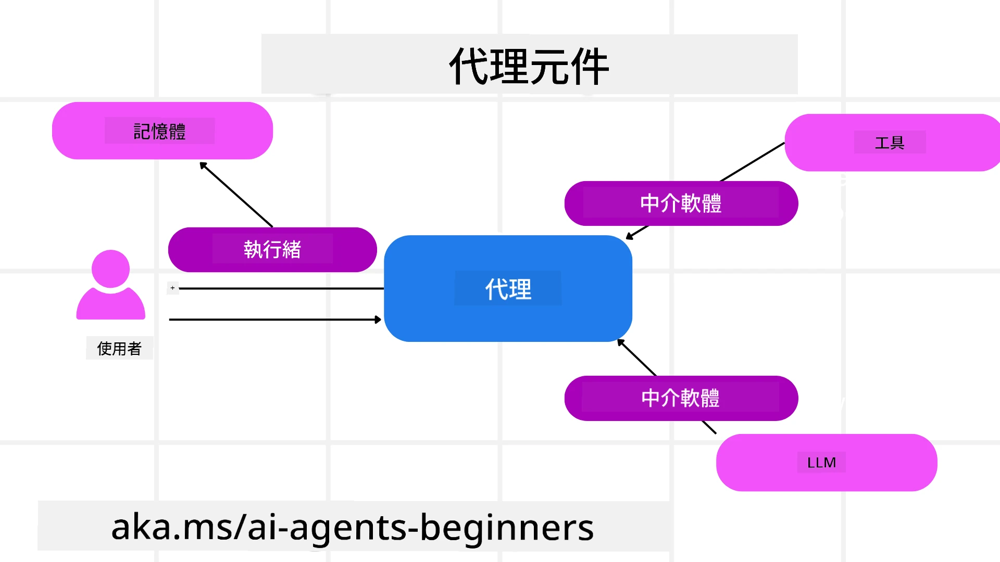

# 探索 Microsoft Agent Framework


### 簡介

本課程將涵蓋：

- 了解 Microsoft Agent Framework：主要特性與價值  
- 探索 Microsoft Agent Framework 的核心概念
- 進階 MAF 範式：工作流程、中介軟體與記憶體

## 學習目標

完成本課程後，您將了解如何：

- 使用 Microsoft Agent Framework 建立生產就緒的 AI 智能代理
- 將 Microsoft Agent Framework 的核心功能套用到您的 Agentic 用例中
- 使用包含工作流程、中介軟體及可觀察性等進階範式

## 程式碼範例

[Microsoft Agent Framework (MAF)](https://aka.ms/ai-agents-beginners/agent-framewrok) 的程式碼範例可在本儲存庫的 `xx-python-agent-framework` 與 `xx-dotnet-agent-framework` 檔案中找到。

## 了解 Microsoft Agent Framework


[Microsoft Agent Framework (MAF)](https://aka.ms/ai-agents-beginners/agent-framewrok) 是微軟用來打造 AI 智能代理的統一框架。它提供靈活性，能夠應對在生產和研究環境中各式各樣的智能代理用例，包括：

- 在需要逐步工作流程的情境中使用 <strong>序列式智能代理編排</strong>。
- 在多個代理需同時完成任務的情境下使用 <strong>併發式編排</strong>。
- 在代理可共同協作完成某項任務的情境下使用 <strong>群組聊天編排</strong>。
- 在子任務完成後，代理彼此交接任務的情境中使用 <strong>交接編排</strong>。
- 在管理代理負責建立與調整任務列表並協調子代理完成任務的情境下使用 <strong>磁性編排</strong>。

為了在生產環境中交付 AI 智能代理，MAF 也包含以下功能：

- 利用 OpenTelemetry 提供 <strong>可觀察性</strong>，紀錄 AI 智能代理的每項行動，包括工具呼叫、編排步驟、推理流程，以及透過 Microsoft Foundry 儀表板的效能監控。
- 利用 Microsoft Foundry 本地托管代理，包含角色存取、私人資料處理及內建內容安全控管等，確保 <strong>安全性</strong>。
- 代理線程及工作流程能暫停、繼續及錯誤復原，支援更長時間運行的 <strong>耐久性</strong>。
- 支援「人員介入」工作流程，標示任務需要人工核准，強化 <strong>控制力</strong>。

Microsoft Agent Framework 同時著眼於互通性，特色包括：

- <strong>雲端中立</strong> - 智能代理可在容器、內部部署或多種不同雲端環境中執行。
- <strong>供應商中立</strong> - 可使用您偏好的 SDK 建立智能代理，包括 Azure OpenAI 與 OpenAI。
- <strong>整合開放標準</strong> - 智能代理可利用 Agent-to-Agent (A2A) 與 Model Context Protocol (MCP) 等協定，發現並使用其他代理及工具。
- <strong>插件與連接器</strong> - 能連接 Microsoft Fabric、SharePoint、Pinecone 及 Qdrant 等資料與記憶體服務。

接下來，我們將探討這些功能如何應用於 Microsoft Agent Framework 的核心概念。

## Microsoft Agent Framework 的核心概念

### 智能代理



<strong>建立智能代理</strong>

建立代理是透過定義推論服務（LLM 提供者）、一組供智能代理遵循的指示，以及分配的 `name` 來完成：

```python
agent = AzureOpenAIChatClient(credential=AzureCliCredential()).create_agent( instructions="You are good at recommending trips to customers based on their preferences.", name="TripRecommender" )
```

上述示範使用 `Azure OpenAI`，但也可使用多種服務建立代理，包括 `Microsoft Foundry Agent Service`：

```python
AzureAIAgentClient(async_credential=credential).create_agent( name="HelperAgent", instructions="You are a helpful assistant." ) as agent
```

OpenAI 的 `Responses`、`ChatCompletion` API

```python
agent = OpenAIResponsesClient().create_agent( name="WeatherBot", instructions="You are a helpful weather assistant.", )
```

```python
agent = OpenAIChatClient().create_agent( name="HelpfulAssistant", instructions="You are a helpful assistant.", )
```

或 [MiniMax](https://platform.minimaxi.com/) ，它提供支援大型上下文視窗（最高 204K 代幣）的 OpenAI 兼容 API：

```python
agent = OpenAIChatClient(base_url="https://api.minimax.io/v1", api_key=os.environ["MINIMAX_API_KEY"], model_id="MiniMax-M2.7").create_agent( name="HelpfulAssistant", instructions="You are a helpful assistant.", )
```

或使用 A2A 協定的遠端代理：

```python
agent = A2AAgent( name=agent_card.name, description=agent_card.description, agent_card=agent_card, url="https://your-a2a-agent-host" )
```

<strong>運行智能代理</strong>

代理可透過 `.run` 或 `.run_stream` 方法運行，以取得非串流或串流回應。

```python
result = await agent.run("What are good places to visit in Amsterdam?")
print(result.text)
```

```python
async for update in agent.run_stream("What are the good places to visit in Amsterdam?"):
    if update.text:
        print(update.text, end="", flush=True)

```

每次代理運行還可選擇自訂參數，例如代理使用的 `max_tokens`、代理可呼叫的 `tools`，甚至是代理本身所用的 `model`。

在需要特定模型或工具來完成用戶任務的情況下，此功能非常實用。

<strong>工具</strong>

工具可在定義代理時指定：

```python
def get_attractions( location: Annotated[str, Field(description="The location to get the top tourist attractions for")], ) -> str: """Get the top tourist attractions for a given location.""" return f"The top attractions for {location} are." 


# 直接建立 ChatAgent 時

agent = ChatAgent( chat_client=OpenAIChatClient(), instructions="You are a helpful assistant", tools=[get_attractions]

```

也可在運行代理時指定：

```python

result1 = await agent.run( "What's the best place to visit in Seattle?", tools=[get_attractions] # 僅為此次執行提供的工具 )
```

<strong>代理線程</strong>

代理線程用於管理多輪對話。建立線程方式有：

- 使用 `get_new_thread()`，啟用線程可隨時間存留
- 運行代理時自動建立線程，且線程只存在於當前執行期間

建立線程代碼如下：

```python
# 創建一個新的執行緒。
thread = agent.get_new_thread() # 使用該執行緒運行代理。
response = await agent.run("Hello, I am here to help you book travel. Where would you like to go?", thread=thread)

```

接著可將線程序列化以便後續存取：

```python
# 建立一個新的執行緒。
thread = agent.get_new_thread() 

# 使用該執行緒運行代理。

response = await agent.run("Hello, how are you?", thread=thread) 

# 將執行緒序列化以便儲存。

serialized_thread = await thread.serialize() 

# 從儲存中載入後反序列化執行緒狀態。

resumed_thread = await agent.deserialize_thread(serialized_thread)
```

<strong>代理中介軟體</strong>

代理與工具及 LLM 互動完成用戶任務。在某些情境下，我們希望在這些互動過程中執行或追蹤動作。代理中介軟體可實現此功能：

<em>函式中介軟體</em>

此中介軟體允許我們在代理與調用的函式／工具之間執行動作。例如在函式呼叫時做記錄。

以下程式碼中，`next` 會定義是否調用下一個中介軟體或實際的函式。

```python
async def logging_function_middleware(
    context: FunctionInvocationContext,
    next: Callable[[FunctionInvocationContext], Awaitable[None]],
) -> None:
    """Function middleware that logs function execution."""
    # 預處理：函式執行前的日誌記錄
    print(f"[Function] Calling {context.function.name}")

    # 繼續執行下一個中介軟體或函式
    await next(context)

    # 後處理：函式執行後的日誌記錄
    print(f"[Function] {context.function.name} completed")
```

<em>聊天中介軟體</em>

此中介軟體讓我們在代理與 LLM 的請求間執行或記錄動作。

這包含重要資訊，如傳送給 AI 服務的 `messages` 。

```python
async def logging_chat_middleware(
    context: ChatContext,
    next: Callable[[ChatContext], Awaitable[None]],
) -> None:
    """Chat middleware that logs AI interactions."""
    # 前置處理：呼叫 AI 前記錄日誌
    print(f"[Chat] Sending {len(context.messages)} messages to AI")

    # 繼續到下一個中介軟體或 AI 服務
    await next(context)

    # 後置處理：在 AI 回應後記錄日誌
    print("[Chat] AI response received")

```

<strong>代理記憶體</strong>

如在 `Agentic Memory` 課程中所述，記憶體是讓代理能在不同語境下運作的重要元素。MAF 提供數種記憶體類型：

<em>記憶體內儲存</em>

是指應用運行時線程中儲存的記憶體。

```python
# 建立一個新的執行緒。
thread = agent.get_new_thread() # 使用該執行緒執行代理程式。
response = await agent.run("Hello, I am here to help you book travel. Where would you like to go?", thread=thread)
```

<em>持久化訊息</em>

用於跨多個會話存儲對話歷史紀錄。使用 `chat_message_store_factory` 定義：

```python
from agent_framework import ChatMessageStore

# 建立自訂訊息儲存庫
def create_message_store():
    return ChatMessageStore()

agent = ChatAgent(
    chat_client=OpenAIChatClient(),
    instructions="You are a Travel assistant.",
    chat_message_store_factory=create_message_store
)

```

<em>動態記憶</em>

此記憶會在運行代理前加入上下文，可存放於外部服務如 mem0：

```python
from agent_framework.mem0 import Mem0Provider

# 使用 Mem0 以獲得先進的記憶體功能
memory_provider = Mem0Provider(
    api_key="your-mem0-api-key",
    user_id="user_123",
    application_id="my_app"
)

agent = ChatAgent(
    chat_client=OpenAIChatClient(),
    instructions="You are a helpful assistant with memory.",
    context_providers=memory_provider
)

```

<strong>代理可觀察性</strong>

可觀察性對建立可靠且易維護的智能代理系統至關重要。MAF 集成 OpenTelemetry 提供追蹤與計量工具，強化可觀察性。

```python
from agent_framework.observability import get_tracer, get_meter

tracer = get_tracer()
meter = get_meter()
with tracer.start_as_current_span("my_custom_span"):
    # 做某事
    pass
counter = meter.create_counter("my_custom_counter")
counter.add(1, {"key": "value"})
```

### 工作流程

MAF 提供預定義步驟的工作流程以完成任務，工作流程的步驟中包含 AI 智能代理作為元件。

工作流程由不同的元件組成，以提供更好的控制流程。工作流程也支持 <strong>多代理編排</strong> 與 <strong>檢查點</strong> 以保存工作流程狀態。

工作流程的核心元件如下：

<strong>執行器</strong>

執行器接收輸入訊息，執行分配的任務，然後產生輸出訊息。這推動工作流程向完成更大任務邁進。執行器可以是 AI 智能代理或自訂邏輯。

<strong>邊緣</strong>

邊緣用於定義工作流程中訊息的流動，可分為：

<em>直接邊緣</em> - 執行器之間的一對一簡單連線：

```python
from agent_framework import WorkflowBuilder

builder = WorkflowBuilder()
builder.add_edge(source_executor, target_executor)
builder.set_start_executor(source_executor)
workflow = builder.build()
```

<em>條件邊緣</em> - 在特定條件被觸發後啟動。例如當飯店房間無空位時，執行器可建議其他選項。

<em>切換分支邊緣</em> - 根據條件將訊息路由至不同執行器。例如旅遊客戶有優先權並將通過另一工作流程處理任務。

<em>分流邊緣</em> - 將一則訊息傳送至多個目標。

<em>彙合邊緣</em> - 收集來自不同執行器的多個訊息並傳送至一個目標。

<strong>事件</strong>

為了加強對工作流程的可觀察性，MAF 提供執行相關的內建事件，包括：

- `WorkflowStartedEvent`  - 工作流程啟動
- `WorkflowOutputEvent` - 工作流程產生輸出
- `WorkflowErrorEvent` - 工作流程發生錯誤
- `ExecutorInvokeEvent`  - 執行器開始處理
- `ExecutorCompleteEvent`  -  執行器完成處理
- `RequestInfoEvent` - 發出請求

## 進階 MAF 範式

以上章節涵蓋 Microsoft Agent Framework 的核心概念。隨著您建立更複雜的代理，以下是一些值得考慮的進階範式：

- <strong>中介軟體組合</strong>：透過函式及聊天中介軟體串聯多個中介軟體處理器（如記錄、認證、流量限制），對代理行為進行細緻控管。
- <strong>工作流程檢查點</strong>：利用工作流程事件及序列化技術，保存並繼續長時間運行的代理程序。
- <strong>動態工具選擇</strong>：結合基於工具描述的 RAG 與 MAF 工具註冊，只顯示與查詢相關的工具。
- <strong>多代理交接</strong>：使用工作流程邊緣與條件路由編排專精代理間的任務交接。

## 程式碼範例

Microsoft Agent Framework 的程式碼範例可在本儲存庫的 `xx-python-agent-framework` 與 `xx-dotnet-agent-framework` 檔案中找到。

## 有更多 Microsoft Agent Framework 的問題嗎？

加入 [Microsoft Foundry Discord](https://aka.ms/ai-agents/discord) 與其他學習者互動，參加辦公時間，並獲得 AI 智能代理相關問題的解答。

---

<!-- CO-OP TRANSLATOR DISCLAIMER START -->
**免責聲明**：  
本文件由 AI 翻譯服務 [Co-op Translator](https://github.com/Azure/co-op-translator) 進行翻譯。雖然我們努力確保準確性，但請注意自動翻譯可能包含錯誤或不準確之處。原始文件的母語版本應視為權威來源。對於重要資訊，建議使用專業人工翻譯。我們不對因使用本翻譯所產生的任何誤解或誤釋負責。
<!-- CO-OP TRANSLATOR DISCLAIMER END -->